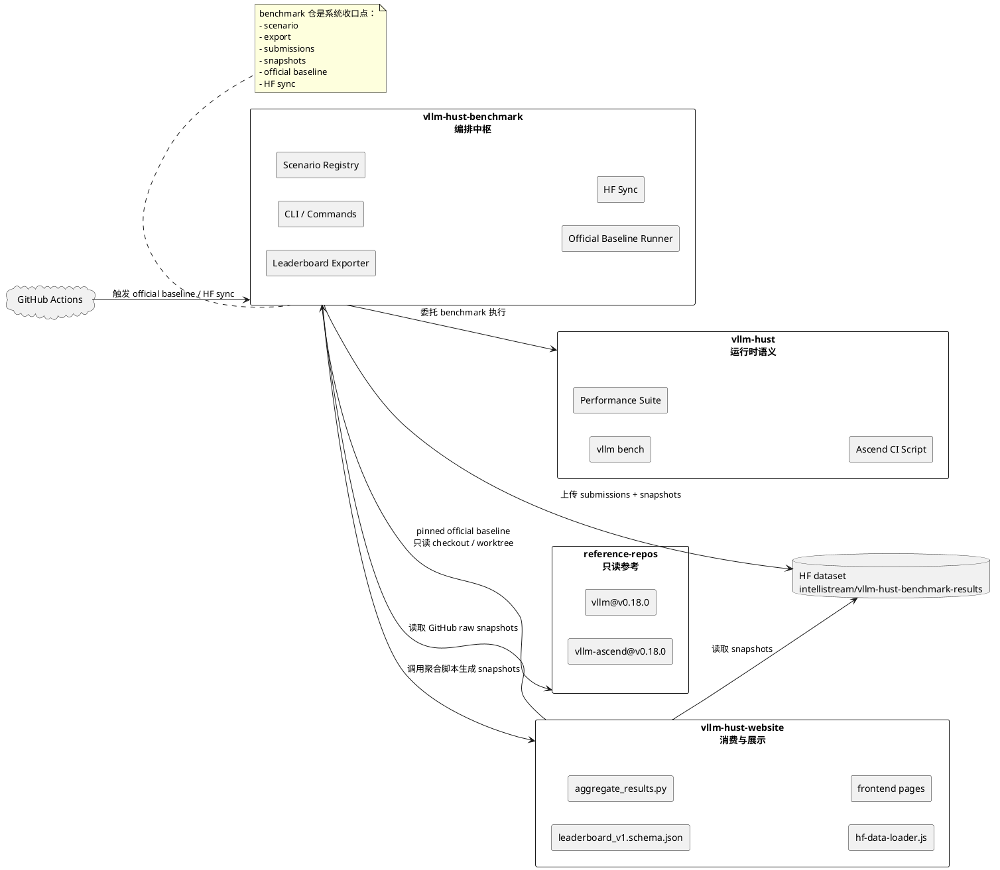
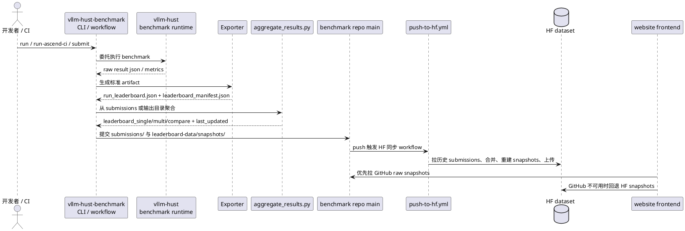
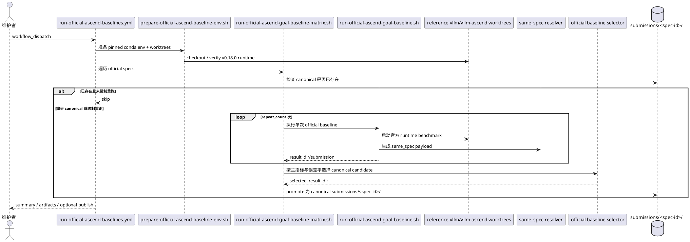
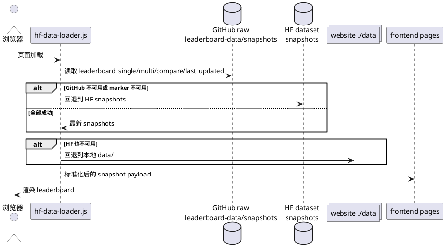
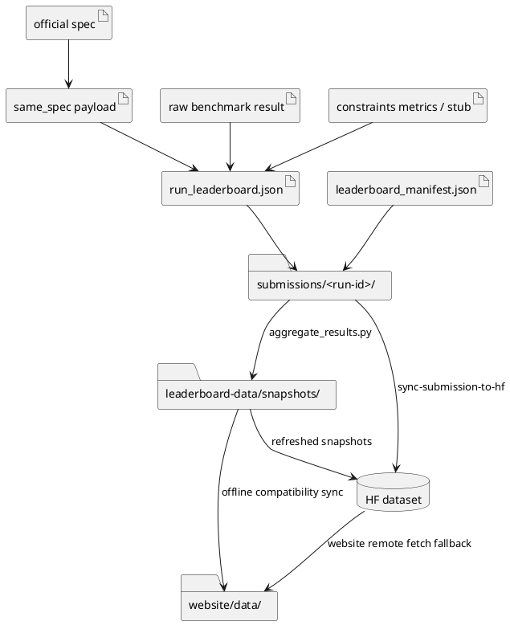
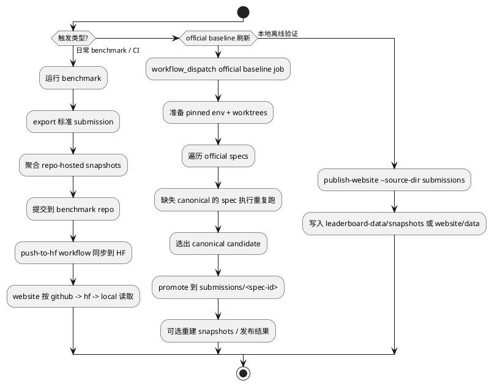

# Leaderboard 工作交接文档

## 文档定位

本交接文档面向接手 leaderboard 相关工作的团队，目标不是单纯描述“现在有哪些代码”，而是明确下面几件事：

1. 哪些仓库和外部系统共同构成 leaderboard 生产链路。
2. 每个接口、数据产物、控制触发点分别由谁定义、谁写入、谁消费。
3. 哪些约束属于必须延续的架构不变量，哪些是当前分支的阶段性实现。
4. 接手团队如何在最短时间内具备可维护、可发布、可扩展的接管能力。

相较于“仓库全景图 + 数据流 + 控制流 + 当前进展”的初步思路，本版文档额外补入了最佳实践里更关键的几层内容：

1. Source of truth 划分。
2. 写入边界与消费边界。
3. 运营所需的最小 runbook。
4. 设计不变量。
5. 明确的接手优先级和验收清单。

## 交接快照

| 项目 | 当前值 |
| --- | --- |
| 快照日期 | 2026-05-31 |
| 基线分支 | `ws/official-baseline-v2` |
| 交接范围 | leaderboard 数据链路、官方 Ascend baseline 体系、网站消费链路 |
| 编排中枢仓 | `vllm-hust-benchmark` |
| 运行时语义来源 | `vllm-hust` |
| 官方 baseline 参考源 | `reference-repos/vllm` + `reference-repos/vllm-ascend` |
| 网站消费仓 | `vllm-hust-website` |
| 远端分发仓 | Hugging Face dataset `intellistream/vllm-hust-benchmark-results` |

## 1. 建议先建立的认知模型

这个系统不是单仓系统，而是一个“多仓协作、单链路收口”的 leaderboard 发布体系：

1. `vllm-hust` 负责 benchmark 运行时语义，提供 `vllm bench ...` 和上游 performance suite。
2. `vllm-hust-benchmark` 负责场景注册、命令拼装、结果导出、submission 归档、snapshot 生成、HF 同步、official baseline 自动化。
3. `vllm-hust-website` 负责 schema、聚合逻辑和前端消费，只接受标准化聚合后的 snapshot，不直接吃零散原始 benchmark 结果。
4. `reference-repos/vllm` 与 `reference-repos/vllm-ascend` 是只读对照源，用于 pinned baseline，不是业务开发主仓。
5. GitHub 仓库存档与 HF dataset 分发共同组成线上数据源，其中 website 前端当前优先读 GitHub snapshot，再回退到 HF，再回退到本地静态文件。

如果接手团队只盯住 website 或只盯住 benchmark 仓，都会失真。正确视角应当是：

`benchmark standard export -> submissions -> aggregated snapshots -> GitHub/HF distribution -> website consumption`

## 2. Source Of Truth 与所有权

| 领域 | Source of truth | 写入方 | 主要消费方 | 说明 |
| --- | --- | --- | --- | --- |
| benchmark 运行时语义 | `vllm-hust` | `vllm-hust` 团队 | `vllm-hust-benchmark` | benchmark repo 不应复制或重写 runtime benchmark 逻辑 |
| leaderboard 场景定义 | `src/vllm_hust_benchmark/data/official_scenarios.json` | `vllm-hust-benchmark` | exporter、CLI、website 聚合 | workload/business scenario/config 映射在这里冻结 |
| 标准 submission contract | `leaderboard_manifest.json` + `run_leaderboard.json` + website schema | `vllm-hust-benchmark` exporter | website 聚合、HF 同步 | 这是跨仓边界，不允许 ad hoc JSON |
| model identity contract | benchmark model registry + website schema | `vllm-hust-benchmark` | website filters、compare grouping | 已完成 canonical_id/repo_id/display_name 正规化 |
| official baseline spec | `docs/official-baselines/*.json` | `vllm-hust-benchmark` | official runner、same-spec、baseline coverage | 当前公开官方目标固定为 Ascend + `v0.18.0`; `v0.11.0` 已退役，不得进入 public snapshots |
| website 聚合输出 | `leaderboard_single.json` / `leaderboard_multi.json` / `leaderboard_compare.json` / `last_updated.json` | 聚合脚本生成 | website 前端 | website 不应手工维护这些文件 |
| website 数据源优先级 | `assets/hf-data-loader.js` | `vllm-hust-website` | 前端 | 当前优先级是 `github -> hf -> local` |
| baseline 线上分发 | benchmark repo snapshots + HF dataset | benchmark workflows | website 前端 | GitHub 仓库提供第一优先级 freshness，HF 提供 canonical aggregate |

建议接手后第一时间把这个表内化为责任边界。它比“代码在哪”更重要。

## 3. 仓库全景图

### 3.1 仓库级架构图



### 3.2 仓库角色说明

| 仓库 / 系统 | 角色 | 关键路径 | 读写属性 | 接手建议 |
| --- | --- | --- | --- | --- |
| `vllm-hust-benchmark` | 编排中枢 | `src/vllm_hust_benchmark/`, `.github/workflows/`, `scripts/`, `submissions/`, `leaderboard-data/snapshots/` | 读写 | 接手团队的主战场 |
| `vllm-hust` | benchmark 运行时与上游兼容入口 | `benchmarks/`, `.buildkite/performance-benchmarks/`, CI scripts | 主要只读消费 | 不建议在 leaderboard 任务里复制实现 |
| `vllm-hust-website` | schema、聚合、前端读取 | `scripts/aggregate_results.py`, `data/schemas/`, `assets/hf-data-loader.js` | 读写 | 需要联合维护接口契约 |
| `reference-repos/vllm` | 上游 baseline runtime | pinned ref / worktree | 只读 | 仅用于官方对照，不承接业务改造 |
| `reference-repos/vllm-ascend` | 官方 Ascend baseline runtime | pinned ref / worktree | 只读 | 用于 official baseline target |
| GitHub Actions | 自动化控制平面 | `run-official-ascend-baselines.yml`, `push-to-hf.yml` | 读写自动化 | 需要 secrets 与 runner 能力 |
| Hugging Face dataset | 聚合结果远端分发面 | snapshot files + canonical submissions | 读写 | 需要 token、数据布局稳定 |

## 4. 仓库间接口

### 4.1 接口矩阵

| 调用方 | 被调用方 | 接口形式 | 稳定性要求 | 备注 |
| --- | --- | --- | --- | --- |
| `vllm-hust-benchmark` | `vllm-hust` | CLI / shell delegation | 高 | 通过 `integration.py` 构建并转发 `vllm bench` 或 performance suite |
| `vllm-hust-benchmark` | `vllm-hust-website` | `aggregate_results.py --source-dir ... --output-dir ...` | 高 | 这是标准聚合边界 |
| `vllm-hust-benchmark` | HF dataset | `sync-submission-to-hf` / `publish-hf` | 高 | 上传 snapshot 和 canonical raw submission |
| `vllm-hust-website` | benchmark repo / HF | 静态 JSON 拉取 | 高 | 当前 loader 优先级：GitHub -> HF -> local |
| official runner | spec JSON | `docs/official-baselines/*.json` | 高 | spec id、baseline target、server/client parameters 必须可解析 |
| exporter | same-spec payload | `benchmark-same-spec/v1` | 高 | same-spec 是 compare 和 official baseline 的关键可比性锚点 |

### 4.2 官方场景列表

当前 registry 已定义 8 个官方场景：

| 场景 | benchmark type | business scenario |
| --- | --- | --- |
| `sharegpt-online` | `serve` | `online-chat` |
| `random-online` | `serve` | `online-chat` |
| `prefix-repetition-online` | `serve` | `long-context-chat` |
| `instructcoder-online` | `serve` | `code-assistant` |
| `visionarena-online` | `serve` | `multimodal-chat` |
| `sharegpt-throughput` | `throughput` | `offline-batch-serving` |
| `sonnet-throughput` | `throughput` | `offline-batch-serving` |
| `random-latency` | `latency` | `latency-slo` |

这些场景不是 website 自己定义的，而是 benchmark registry 定义后映射到 website workload/business taxonomy。

## 5. 关键业务场景与交互流程

### 5.1 常规 benchmark 提交与发布

这是 leaderboard 的主链路，适用于 CI 提交、日常性能回归、人工实验归档。



### 5.2 Quantized Ascend workflow-dispatch runbook

量化模型 benchmark 通过 `vllm-ascend-hust` 的 `Ascend Benchmark Leaderboard`
workflow 手动触发。合入主线后，所有仓库 ref 默认应保持 `main`，只覆盖模型与量化相关字段：

| workflow input | 合入主线后的默认值 / 量化运行取值 | 说明 |
| --- | --- | --- |
| `ascend_hust_target` | `vLLM-HUST/vllm-ascend-hust@main` | 被测 Ascend plugin ref；分支验证时才填 `ws/*`。 |
| `vllm_hust_ref` | `main` | paired runtime ref。 |
| `benchmark_ref` | `main` | benchmark runner/export ref；合入后不得默认依赖功能分支。 |
| `model_name` | `aly16/Qwen2.5-14B-W8A8` | Hugging Face model id 或本地模型路径，不能填 git branch。 |
| `model_precision` | `INT8` | leaderboard precision metadata。 |
| `model_quantization` | `W8A8` | 量化方案 metadata。 |
| `dtype` | `auto` | Ascend modelslim/W8A8 必须使用 `auto`，不要填 `int8`。 |
| `hardware_chip_model` | `910B2` | 与实际 runner 芯片一致。 |
| `dataset_path` / `constraints_file` | empty for `random-online` | ShareGPT/formal workload 才需要外部路径。 |

运行链路必须保证 workflow input 逐层传播：`workflow_dispatch` ->
`run_ascend_benchmark_ci.sh` -> `run-current-ascend-same-spec.sh` ->
`same_spec.py` -> leaderboard exporter。尤其是 `DTYPE=auto` 必须覆盖 spec 中
由 `model_precision` 推导出的默认 dtype，否则量化模型可能在 vLLM/Ascend 权重加载阶段失败。

`leaderboard_compare.json` 的 `hard_constraints.scopes` 是独立 snapshot：即使
`groups=[]` 且 `goal_progress.pairs=[]` 也可以合法存在。校验不应要求每个
hard-constraint scope 同时具备 compare pair 或 baseline row，只需确认
`scope_key` 能在 `leaderboard_single.json` / `leaderboard_multi.json` 的
`vllm-hust` entry 中找到。

### 5.3 官方 Ascend baseline 批量刷新

这是当前分支最重要的新增能力。它的目标不是做一次普通 benchmark，而是生成“可长期对照、可 canonical 化、可 compare 使用”的官方基线。



### 5.4 Website 消费链路

website 不是 leaderboard 的生产者，只是标准 snapshot 的消费者。



## 6. 数据流与 artifact 生命周期

### 6.1 关键 artifact 清单

| Artifact | 生产方 | 典型路径 | 消费方 | 说明 |
| --- | --- | --- | --- | --- |
| official baseline spec | benchmark repo | `docs/official-baselines/*.json` | official runner、same-spec resolver | 定义 pinned target、场景、server/client 参数 |
| raw benchmark result | runtime benchmark | `.benchmarks/.../*.json` | exporter | 原始运行结果，不是跨仓 contract |
| constraints metrics / stub | benchmark repo 或外部评估 | `docs/official-baselines/*constraints*.json` | exporter | 当前官方 baseline 可先用 stub，后续建议补真实约束指标 |
| same-spec payload | `vllm_hust_benchmark.same_spec` | `same_spec.json` 或嵌入 artifact | compare、official baseline 校验 | 锚定可比参数与 spec hash |
| single submission artifact | exporter | `run_leaderboard.json` | website aggregator、HF sync | schema-compatible 单条记录 |
| submission manifest | exporter | `leaderboard_manifest.json` | aggregator、validator、HF sync | 声明 artifact 与 idempotency key |
| raw submission directory | benchmark repo | `submissions/<run-id>/` | push-to-hf、website offline aggregate | benchmark 归档边界 |
| repo-hosted snapshots | benchmark repo | `leaderboard-data/snapshots/*.json` | website GitHub source | 线上第一优先级 freshness 来源 |
| website snapshots | website repo | `data/*.json` | 前端、本地离线预览 | compatibility cache，不应手工改 |
| HF snapshots | HF dataset | root snapshot files | website HF source | 远端 canonical aggregate 分发面 |

### 6.2 数据流图



### 6.3 当前数据边界结论

1. 对外稳定边界是 `leaderboard_manifest.json` + `run_leaderboard.json`，不是 raw benchmark result。
2. `leaderboard_compare.json` 是聚合派生产物，不是第二种 submission schema。
3. website 不应自行修补单条 entry，数据错误必须回到 exporter 或 submission 源头修正。
4. HF 同步并不是简单 upload 单个文件，而是“拉取历史 raw submissions -> 合并 -> 重建 snapshots -> 验证 -> 一次性提交”。

## 7. 控制流

### 7.1 高层控制流图



### 7.2 主要自动化入口

| 入口 | 作用 | 典型使用方式 |
| --- | --- | --- |
| `python -m vllm_hust_benchmark.cli show-repos --validate` | 校验 sibling repo 布局 | 接手后第一个命令 |
| `python -m vllm_hust_benchmark.cli publish-website --source-dir submissions --output-dir leaderboard-data/snapshots --execute` | 从 submissions 重建 snapshots | 日常回归、本地验链 |
| `python -m vllm_hust_benchmark.cli sync-submission-to-hf ... --execute` | 合并 raw submissions、重建 snapshots、同步 HF | workflow 内主入口 |
| `.github/workflows/push-to-hf.yml` | 监听 `submissions/**` 变化并同步 HF | 线上分发自动化 |
| `.github/workflows/run-official-ascend-baselines.yml` | 批量刷新官方 Ascend baseline | `workflow_dispatch` |
| `scripts/run-official-ascend-goal-baseline-matrix.sh` | 遍历 specs、重复运行、挑 canonical | 本地或 workflow 调用 |
| `scripts/run-official-ascend-goal-baseline.sh` | 单 spec 运行 pinned official baseline | matrix 内部调用 |
| `scripts/prepare-official-ascend-baseline-env.sh` | 准备官方基线 conda env 与 worktree | official baseline 前置步骤 |

### 7.3 运行所需的外部前提

| 前提 | 用途 | 当前体现 |
| --- | --- | --- |
| self-hosted ARM64 runner | 跑官方 Ascend baseline | workflow labels: `self-hosted`, `ARM64`, `docker`, `debug` |
| `VLLM_ASCEND_HUST_BENCHMARK_SSH_KEY` | GitHub SSH checkout | official baseline workflow 强依赖 |
| `DATASET_WRITE_TOKEN` | HF dataset 写入 | `push-to-hf.yml` 使用 |
| 已配置 conda 环境 | benchmark / baseline 执行 | 当前实现依赖 conda prefix |
| Ascend toolkit / ATB 环境 | official baseline 运行时 | prepare / runner 脚本会 source |
| `reference-repos/vllm` 和 `reference-repos/vllm-ascend` | baseline 参考源 | official prepare 脚本依赖 |

## 8. 架构约束与必须延续的设计不变量

下面这些约束不建议在接手初期改动；如果必须变更，应先形成 RFC。

1. `vllm-hust-benchmark` 必须保持“薄编排层”定位，benchmark runtime 语义继续归属 `vllm-hust`。
2. `reference-repos/*` 保持只读，不在其中承载 leaderboard 业务逻辑或交接文档。
3. website 只消费标准 snapshot，不直接 ingest 原始 compare scratch 文件或手工拼接 JSON。
4. 标准 publish 输入边界固定为 `leaderboard_manifest.json` + referenced artifacts。
5. model identity 继续使用 `canonical_id` / `repo_id` / `short_name` / `display_name` 合同，禁止重新退回“只用 model.name”。
6. `model.name` 仅作为兼容字段，语义冻结为 `repo_id` 的镜像，不再承载短名或 UI label。
7. official baseline compare 继续依赖 same-spec payload；没有 same-spec 的记录不应被伪装成正式对照基线。
8. `baseline_status` 语义继续保持 `official-covered` / `pending-baseline` / `no-baseline-declared` 三态，不要再引入自由文本状态。
9. official Ascend public baseline 当前 pin 到 `vllm v0.18.0` + `vllm-ascend v0.18.0` + `Huawei 910B2`。`v0.11.0` 历史运行已退役，不得重新发布到 public snapshots / website / HF snapshot root。
10. website 数据源优先级当前是 `github -> hf -> local`。如果调整这个策略，需要同时考虑 freshness、缓存 marker、回滚路径和 outage 行为。
11. GitHub repo 中的 `leaderboard-data/snapshots/` 不是冗余副本，而是线上第一优先级读取源；不能简单删除。
12. 数据错误优先在 exporter / submission 源头修，不在 website data 层热修补。

## 9. 当前完成情况

### 9.1 已完成能力

| 能力 | 当前状态 | 说明 |
| --- | --- | --- |
| benchmark wrapper CLI | 已完成 | 支持 `run`、`run-both`、`run-ascend-ci`、`export-leaderboard-artifact`、`publish-website`、`sync-submission-to-hf` 等 |
| 官方场景 registry | 已完成 | 8 个官方场景已入 `official_scenarios.json` |
| leaderboard exporter | 已完成 | 支持从 metrics payload 或 raw benchmark result 导出标准 artifact |
| website 聚合链路 | 已完成 | benchmark 可直接调用 website `aggregate_results.py` 生成 snapshots |
| HF 同步链路 | 已完成 | 支持从本地 submission 与历史 HF submission 合并重建 snapshots |
| model identity normalization | 已完成 | benchmark、website、checked-in snapshots 已统一使用规范化模型身份 |
| official baseline 基础设施 | 已完成 | prepare script、single runner、matrix runner、workflow 已具备 |
| official baseline sticky 单卡复用 | 已完成 | 同一 matrix run 会维护 `preferred-ascend-device`，后续 repeat 或后续 spec 若该卡仍空闲则优先复用 |
| baseline canonical 选择逻辑 | 已完成 | 已有 median + error-rate 选择逻辑与测试 |
| repo-hosted snapshots | 已完成 | 当前分支中 `leaderboard-data/snapshots/` 已存在 4 个标准文件 |

### 9.2 当前分支的落地状态

| 项目 | 当前状态 |
| --- | --- |
| official baseline spec 数量 | 8 个 |
| 当前已提交的 official canonical submission | `official-ascend-jan-2026-v0.18.0-*` curated set |
| 非官方 submission 存量 | 已存在多批 CI 与实验 submission，可作为聚合链路回归样本 |
| website snapshot 目录 | 已存在并可用于当前分支的本地/仓内验证 |

### 9.3 已知缺口与风险

| 风险 / 缺口 | 影响 | 建议 |
| --- | --- | --- |
| 8 个 official specs 中仅 1 个 canonical submission 已提交到当前分支 | official baseline 覆盖不完整，compare 可信范围有限 | 优先补齐其余 7 个 canonical runs |
| website README 仍出现旧 HF dataset 名称 `intellistream/llm-engine-benchmark-results`，而前端 loader 与 workflow 已使用 `intellistream/vllm-hust-benchmark-results` | 文档漂移，接手团队容易误判线上真实数据源 | 以代码与 workflow 为准，接手后尽快修正文档漂移 |
| 已有 canonical 的 spec 在 `FORCE_RUN_EXISTING=1` 下只会执行一次 review-only rerun | 不能用现有 workflow 直接验证既有 canonical spec 的 repeat-to-repeat sticky 复用 | 要验证多次 repeat 复用，要么使用缺失 canonical 的 spec，要么单独增加 probe mode |
| sticky 单卡复用的真实机复验仍受当时机器空闲卡可用性影响 | 在所有 Ascend 设备忙碌时，运行时只能返回 `all-busy`，无法正向证明 repeat-02 复用了 repeat-01 的卡 | 选择有空闲卡的窗口做一次低成本复验，或补一个 workflow probe mode |
| official baseline 强依赖 self-hosted Ascend 环境、conda、外部 wheel/source 镜像 | 环境漂移会导致 runner 不稳定 | 建议把环境校验与 runner 准入 checklist 独立文档化 |
| official baseline 当前 constraints 多为 stub / null | hard constraints compare 的业务价值未完全落地 | 第二阶段补齐真实约束指标测量 |
| GitHub 与 HF 双分发面增加了心智复杂度 | 运维与排障成本较高 | 保持 source-of-truth 表与 runbook 同步更新 |

## 10. 接手建议

### 10.1 第一优先级

1. 先把系统视为“benchmark 编排系统”，不要把它误解为“website JSON 维护系统”。
2. 先掌握 `submissions/` 和 `leaderboard-data/snapshots/` 两层产物边界，再谈前端展示。
3. 先跑通一遍从本地 submissions 到 snapshot 重建，再尝试官方 baseline 或 HF publish。
4. 先补齐 official baseline coverage，再讨论 compare 口径优化。

### 10.2 建议的接手顺序

1. 接手 `vllm-hust-benchmark` 主仓所有权，并熟悉 CLI、workflow、scripts。
2. 接手与 `vllm-hust-website` 的接口合同，包括 schema、aggregator、frontend loader。
3. 核对并接管 GitHub Actions secrets、self-hosted runner、HF token。
4. 在当前分支完成剩余 7 个 official baseline canonical submissions。
5. 统一修正文档漂移和 repo id 漂移，形成一版稳定运行手册。

### 10.3 建议的 2 周计划

| 时间 | 建议目标 |
| --- | --- |
| 第 1-2 天 | 跑通 `show-repos --validate`、`publish-website`、website 本地读取链路 |
| 第 3-5 天 | 在 self-hosted Ascend runner 上 dry-run official baseline workflow，验证 env 与 worktree 机制 |
| 第 2 周上半 | 补齐剩余 official specs 的 canonical submission |
| 第 2 周下半 | 修正文档漂移、固化接手 runbook、准备主干合并或发布计划 |

## 11. 最小 runbook

### 11.1 接手后第一组验证命令

```bash
python -m vllm_hust_benchmark.cli show-repos --validate
python -m vllm_hust_benchmark.cli list-scenarios
python -m vllm_hust_benchmark.cli list-leaderboard-map
python -m vllm_hust_benchmark.cli publish-website --source-dir submissions --output-dir leaderboard-data/snapshots --execute
```

### 11.2 official baseline 最小入口

```bash
export GOAL_BASELINE_ENV_PREFIX=/path/to/official/conda/env
bash scripts/run-official-ascend-goal-baseline-matrix.sh
```

补充说明：

1. 同一次 matrix run 会把偏好的单卡设备写到 `.benchmarks/<matrix-run-id>/preferred-ascend-device`，后续 repeat 或后续 spec 若该卡保持空闲会优先复用。
2. 如果对已存在 canonical 的 spec 设置 `FORCE_RUN_EXISTING=1`，当前实现只会跑一次 review-only rerun，不会执行多次 repeat 选优，也不会自动覆盖 canonical。

### 11.3 HF 同步主入口

```bash
PYTHONPATH=src python -m vllm_hust_benchmark.cli sync-submission-to-hf \
  --submission-dir submissions/<run-id> \
  --aggregate-output-dir /tmp/leaderboard-data \
  --repo-id intellistream/vllm-hust-benchmark-results \
  --submissions-prefix submissions-auto \
  --execute
```

**默认行为**：上述命令会从 submissions 目录重新聚合生成 snapshots，然后上传到 HF。这是日常使用的标准流程。

### 11.3.1 跳过聚合直接上传（特殊场景）

当需要将 HF write side 精确同步到某个已知的 snapshots 集合时（例如与 read side 数据保持一致），可以使用 `--skip-aggregation` 标志：

```bash
PYTHONPATH=src python -m vllm_hust_benchmark.cli sync-submission-to-hf \
  --aggregate-output-dir leaderboard-data/snapshots \
  --repo-id intellistream/vllm-hust-benchmark-results \
  --skip-aggregation \
  --execute
```

**使用场景**：
- HF write side 数据与 read side 不一致，需要强制同步
- 已知 `leaderboard-data/snapshots/` 中的数据是正确的，需要直接上传
- 不想因 submissions 集合差异导致聚合结果变化

**注意事项**：
- 此标志会跳过 submissions 下载/合并步骤
- 此标志会跳过聚合步骤
- 直接上传 `--aggregate-output-dir` 指定的目录中的 snapshot 文件
- **仅在特殊场景使用**，日常同步请使用默认流程

### 11.4 常见排障切入点

| 症状 | 第一检查点 |
| --- | --- |
| website 数据没刷新 | 先看 benchmark repo 的 `leaderboard-data/snapshots/` 是否已更新，再看 `push-to-hf.yml` 是否成功 |
| compare 数据异常 | 先看 `same_spec`、`baseline_status`、official baseline coverage 是否完整 |
| 模型筛选重复或名称错乱 | 先检查 model identity registry 与规范化字段，不要先改前端 |
| official baseline 失败 | 先检查 conda env、Ascend 环境、runner 标签、SSH key、reference worktrees |
| HF 上传失败 | 先检查 `DATASET_WRITE_TOKEN` 和 repo id，再看 aggregated outputs 是否完整 |

## 12. 接手验收清单

建议接手团队把下面清单作为正式接管完成标准：

- 能独立说明 benchmark、website、HF、GitHub 三者的数据边界。
- 能独立从 `submissions/` 重建 `leaderboard-data/snapshots/`。
- 能独立解释 same-spec、baseline_status、official coverage 三者的作用差异。
- 能独立 dry-run 或执行一次 official baseline matrix。
- 能独立排查 website 未刷新时是 GitHub 源、HF 源还是 local fallback 问题。
- 能确认并维护 `intellistream/vllm-hust-benchmark-results` 的发布链路。
- 能给出下一轮 official baseline 版本轮转方案，而不破坏现有 `v0.18.0` 公开目标的可追溯性，并保持 `v0.11.0` 退役数据不再发布。

## 13. 建议继续阅读的文件

| 文件 | 用途 |
| --- | --- |
| `README.md` | benchmark 仓总体定位与命令入口 |
| `docs/LEADERBOARD_ALIGNMENT.md` | workload/business scenario 对齐合同 |
| `docs/LEADERBOARD_MODEL_IDENTITY_NORMALIZATION.md` | model identity 设计决策 |
| `docs/UPSTREAM_ANALYSIS.md` | 为什么 benchmark repo 保持“薄编排层” |
| `src/vllm_hust_benchmark/cli.py` | 所有公开命令的总入口 |
| `src/vllm_hust_benchmark/leaderboard_export.py` | 标准 artifact 生成逻辑 |
| `src/vllm_hust_benchmark/official_baselines.py` | canonical submission 与 candidate 选择逻辑 |
| `.github/workflows/run-official-ascend-baselines.yml` | 官方 baseline 控制平面 |
| `.github/workflows/push-to-hf.yml` | HF 同步控制平面 |
| `scripts/run-official-ascend-goal-baseline.sh` | 单 spec official baseline 运行逻辑 |
| `scripts/run-official-ascend-goal-baseline-matrix.sh` | 批量执行与 canonical promotion |
| `../vllm-hust-website/scripts/aggregate_results.py` | 聚合与 compare snapshot 生成逻辑 |
| `../vllm-hust-website/assets/hf-data-loader.js` | website 实际数据源优先级与回退策略 |

## 14. 结论

当前 leaderboard 体系已经从“零散 benchmark 结果展示”演进到“多仓编排、标准 artifact、双分发面、官方 baseline 可追踪”的阶段。接手团队真正要延续的不是某几个 JSON 文件，而是以下三条主线：

1. 标准化 artifact contract。
2. benchmark repo 作为编排中枢的角色。
3. official baseline 作为可长期 compare 的制度化能力。

只要这三条主线不被打断，后续无论是补齐 official coverage、切换新 baseline 版本、还是扩展新 workload，都可以平滑演进。