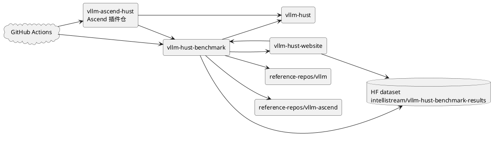
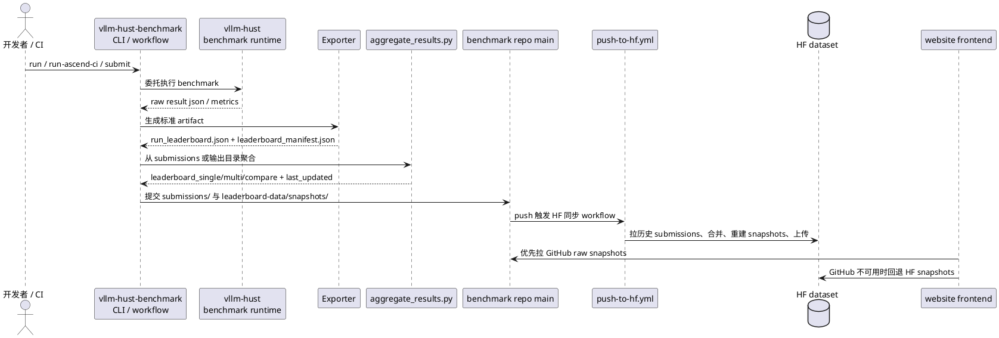
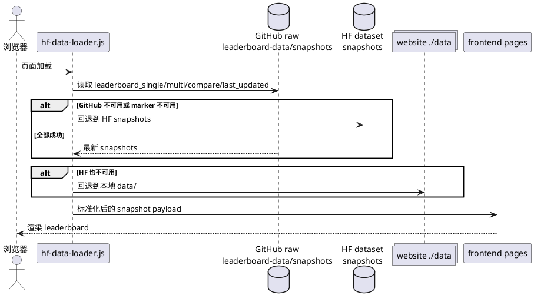
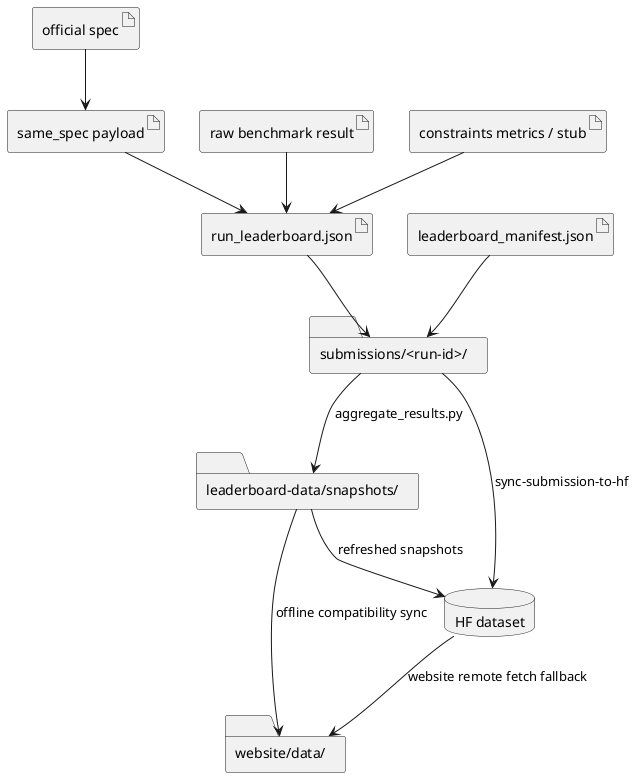
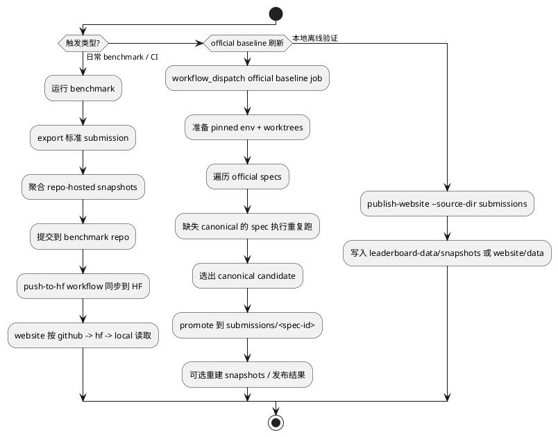

# Leaderboard 工作交接文档

## 文档定位

本交接文档面向接手 leaderboard 相关工作的团队，目标不是单纯描述“现在有哪些代码”，而是明确下面几件事：

1. 哪些仓库和外部系统共同构成 leaderboard 生产链路。
2. 每个接口、数据产物、控制触发点分别由谁定义、谁写入、谁消费。
3. 哪些约束属于必须延续的架构不变量，哪些是当前分支的阶段性实现。
4. 接手团队如何在最短时间内具备可维护、可发布、可扩展的接管能力。

相较于“仓库全景图 + 数据流 + 控制流 + 当前进展”的初步思路，本版文档额外补入了最佳实践里更关键的几层内容：

1. Source of truth 划分。
2. 写入边界与消费边界。
3. 运营所需的最小 runbook。
4. 设计不变量。
5. 明确的接手优先级和验收清单。

## 交接快照

| 项目 | 当前值 |
| --- | --- |
| 快照日期 | 2026-05-31 |
| 当前整理分支 | `ws/leaderboard-handoff-scenarios-20260531` |
| 交接范围 | leaderboard 数据链路、官方 Ascend baseline 体系、网站消费链路 |
| 编排中枢仓 | `vllm-hust-benchmark` |
| 运行时语义来源 | `vllm-hust` |
| 官方 baseline 参考源 | `reference-repos/vllm` + `reference-repos/vllm-ascend` |
| 网站消费仓 | `vllm-hust-website` |
| 远端分发仓 | Hugging Face dataset `intellistream/vllm-hust-benchmark-results` |

## 1. 建议先建立的认知模型

这个系统不是单仓系统，而是一个“多仓协作、单链路收口”的 leaderboard 发布体系：

1. `vllm-hust` 负责 benchmark 运行时语义，提供 `vllm bench ...` 和上游 performance suite。
2. `vllm-ascend-hust` 是 `vllm-hust` 的 Ascend 插件仓，承载 Ascend 插件扩展、trusted runner 上的 benchmark workflow 入口以及与 `vllm-hust-benchmark` 的联动；当前远程 `main` 上这类 workflow / script 同名文件在 `vllm-hust` 与 `vllm-ascend-hust` 两边都存在，但内容并不相同，因此不能只用“文件名”判断单一归属。
3. `vllm-hust-benchmark` 负责场景注册、命令拼装、结果导出、submission 归档、snapshot 生成、HF 同步、official baseline 自动化。
4. `vllm-hust-website` 负责 schema、聚合逻辑和前端消费，只接受标准化聚合后的 snapshot，不直接吃零散原始 benchmark 结果。
5. `reference-repos/vllm` 与 `reference-repos/vllm-ascend` 是只读对照源，用于 pinned baseline，不是业务开发主仓。
6. GitHub 仓库存档与 HF dataset 分发共同组成线上数据源，其中 website 前端当前优先读 GitHub snapshot，再回退到 HF，再回退到本地静态文件。

如果接手团队只盯住 website 或只盯住 benchmark 仓，都会失真。正确视角应当是：

`benchmark standard export -> submissions -> aggregated snapshots -> GitHub/HF distribution -> website consumption`

## 2. Source Of Truth 与所有权

| 领域 | Source of truth | 写入方 | 主要消费方 | 说明 |
| --- | --- | --- | --- | --- |
| benchmark 运行时语义 | `vllm-hust` | `vllm-hust` 团队 | `vllm-hust-benchmark` | benchmark repo 不应复制或重写 runtime benchmark 逻辑 |
| Ascend 插件仓与 benchmark workflow | `vllm-ascend-hust` | `vllm-ascend-hust` 团队 | `vllm-hust` / `vllm-hust-benchmark` | Ascend 插件扩展、trusted runner benchmark workflow、snapshot 回写入口都归这里；同名 workflow / script 文件在 `vllm-hust` 和 `vllm-ascend-hust` 两边都可能出现，需按仓内内容与触发链路区分 |
| leaderboard 场景定义 | `src/vllm_hust_benchmark/data/official_scenarios.json` | `vllm-hust-benchmark` | exporter、CLI、website 聚合 | workload/business scenario/config 映射在这里冻结 |
| 标准 submission contract | `leaderboard_manifest.json` + `run_leaderboard.json` + website schema | `vllm-hust-benchmark` exporter | website 聚合、HF 同步 | 这是跨仓边界，不允许 ad hoc JSON |
| model identity contract | benchmark model registry + website schema | `vllm-hust-benchmark` | website filters、compare grouping | 已完成 canonical_id/repo_id/display_name 正规化 |
| official baseline spec | `docs/official-baselines/*.json` | `vllm-hust-benchmark` | official runner、same-spec、baseline coverage | 当前官方目标固定为 Ascend + `v0.11.0` |
| website 聚合输出 | `leaderboard_single.json` / `leaderboard_multi.json` / `leaderboard_compare.json` / `last_updated.json` | 聚合脚本生成 | website 前端 | website 不应手工维护这些文件 |
| website 数据源优先级 | `assets/hf-data-loader.js` | `vllm-hust-website` | 前端 | 当前优先级是 `github -> hf -> local` |
| baseline 线上分发 | benchmark repo snapshots + HF dataset | benchmark workflows | website 前端 | GitHub 仓库提供第一优先级 freshness，HF 提供 canonical aggregate |

建议接手后第一时间把这个表内化为责任边界。它比“代码在哪”更重要。

## 3. 仓库全景图

### 3.1 仓库级架构图



### 3.2 仓库角色说明

| 仓库 / 系统 | 角色 | 关键路径 | 读写属性 | 接手建议 |
| --- | --- | --- | --- | --- |
| `vllm-hust-benchmark` | 编排中枢 | `src/vllm_hust_benchmark/`, `.github/workflows/`, `scripts/`, `submissions/`, `leaderboard-data/snapshots/` | 读写 | 接手团队的主战场 |
| `vllm-hust` | benchmark 运行时与上游兼容入口 | `benchmarks/`, `.buildkite/performance-benchmarks/`, CI scripts | 主要只读消费 | 不建议在 leaderboard 任务里复制实现 |
| `vllm-ascend-hust` | `vllm-hust` 的 Ascend 插件仓（含 benchmark workflow） | `.github/workflows/ascend-benchmark-leaderboard.yml`, `.github/workflows/scripts/run_ascend_benchmark_ci.sh`, `.github/workflows/scripts/sync_benchmark_snapshots_to_github.sh`, `scripts/`, `tests/` | 读写自动化 | 这是插件扩展仓，不是 runtime 主仓；这些同名 workflow / script 在 `vllm-hust` 也有对应跟踪文件，但 remote main 上内容不同，职责要按仓内实现和触发链路区分 |
| `vllm-hust-website` | schema、聚合、前端读取 | `scripts/aggregate_results.py`, `data/schemas/`, `assets/hf-data-loader.js` | 读写 | 需要联合维护接口契约 |
| `reference-repos/vllm` | 上游 baseline runtime | pinned ref / worktree | 只读 | 仅用于官方对照，不承接业务改造 |
| `reference-repos/vllm-ascend` | 官方 Ascend baseline runtime | pinned ref / worktree | 只读 | 用于 official baseline target |
| GitHub Actions | 自动化控制平面 | `../vllm-ascend-hust/.github/workflows/ascend-benchmark-leaderboard.yml`, `run-official-ascend-baselines.yml`, `push-to-hf.yml` | 读写自动化 | 需要 secrets 与 runner 能力 |
| Hugging Face dataset | 聚合结果远端分发面 | snapshot files + canonical submissions | 读写 | 需要 token、数据布局稳定 |

## 4. 仓库间接口

### 4.1 接口矩阵

| 调用方 | 被调用方 | 接口形式 | 稳定性要求 | 备注 |
| --- | --- | --- | --- | --- |
| `vllm-ascend-hust` | `vllm-hust` | Ascend 插件扩展、workflow 与 shell orchestration | 高 | 插件仓通过 workflow 调用 `vllm-hust` 运行时，并在 trusted runner 上完成 benchmark 执行 |
| `vllm-ascend-hust` | `vllm-hust-benchmark` | `submit` / `sync-submission-to-hf` / snapshot sync 脚本链路 | 高 | 插件仓中的 workflow 调用 benchmark CLI 产出 submission，并触发同步 |
| `vllm-hust-benchmark` | `vllm-hust` | CLI / shell delegation | 高 | 通过 `integration.py` 构建并转发 `vllm bench` 或 performance suite |
| `vllm-hust-benchmark` | `vllm-hust-website` | `aggregate_results.py --source-dir ... --output-dir ...` | 高 | 这是标准聚合边界 |
| `vllm-hust-benchmark` | HF dataset | `sync-submission-to-hf` / `publish-hf` | 高 | 上传 snapshot 和 canonical raw submission |
| `vllm-hust` ↔ `vllm-ascend-hust` | 同名 workflow / script 文件 | 同路径镜像或分叉实现 | 中 | 当前 remote main 上 `.github/workflows/ascend-benchmark-leaderboard.yml`、`.github/workflows/scripts/run_ascend_benchmark_ci.sh`、`.github/workflows/scripts/sync_benchmark_snapshots_to_github.sh` 两边都存在，但 blob 内容不同；不要按路径直接假定归属 |
| `vllm-hust-website` | benchmark repo / HF | 静态 JSON 拉取 | 高 | 当前 loader 优先级：GitHub -> HF -> local |
| official runner | spec JSON | `docs/official-baselines/*.json` | 高 | spec id、baseline target、server/client parameters 必须可解析 |
| exporter | same-spec payload | `benchmark-same-spec/v1` | 高 | same-spec 是 compare 和 official baseline 的关键可比性锚点 |

### 4.2 官方场景列表

当前 registry 已定义 8 个官方场景：

| 场景 | benchmark type | business scenario |
| --- | --- | --- |
| `sharegpt-online` | `serve` | `online-chat` |
| `random-online` | `serve` | `online-chat` |
| `prefix-repetition-online` | `serve` | `long-context-chat` |
| `instructcoder-online` | `serve` | `code-assistant` |
| `visionarena-online` | `serve` | `multimodal-chat` |
| `sharegpt-throughput` | `throughput` | `offline-batch-serving` |
| `sonnet-throughput` | `throughput` | `offline-batch-serving` |
| `random-latency` | `latency` | `latency-slo` |

这些场景不是 website 自己定义的，而是 benchmark registry 定义后映射到 website workload/business taxonomy。

### 4.3 当前支持的 benchmark 场景与参数

如需按 official baseline / current benchmark 的 same-spec 约束查看场景与参数，请直接使用附录文档：`docs/LEADERBOARD_BENCHMARK_SCENARIOS.md`。

主文档只保留接手时最需要的摘要，完整的 same-spec 场景表、参数差异说明和 wrapper 参数范围统一收口到附录，避免后续双份维护。

#### 4.3.1 支持面摘要

当前代码里“场景支持面”的单一事实来源是 `src/vllm_hust_benchmark/data/official_scenarios.json`，并由 `registry.py` 加载为 `ScenarioDefinition`。

| benchmark type | 场景数 | 当前支持场景 |
| --- | --- | --- |
| `serve` | 5 | `sharegpt-online`, `random-online`, `prefix-repetition-online`, `instructcoder-online`, `visionarena-online` |
| `throughput` | 2 | `sharegpt-throughput`, `sonnet-throughput` |
| `latency` | 1 | `random-latency` |

#### 4.3.2 参数语义摘要

参数合并与标准化规则来自 `models.py`，接手时主要记住下面几条：

| 项目 | 规则 |
| --- | --- |
| 默认参数来源 | 每个场景的 `defaults` |
| 运行时覆盖方式 | 通用入口通过重复的 `--set key=value` 覆盖或补充场景参数 |
| 模型参数 | `--model` 是 `run` / `build-command` / `run-both` 的必填参数，不属于场景默认值 |
| serve alias 规则 1 | `num_iters_warmup` 会规范化成 `num_warmups` |
| serve alias 规则 2 | 当 `dataset_name=random` 时，`batch_size` 会规范化成 `random_batch_size` |

#### 4.3.3 Wrapper 差异摘要

| Wrapper | 覆盖范围 | 交接时需要记住的点 |
| --- | --- | --- |
| `run` / `build-command` / `run-both` | 面向 registry，原则上覆盖全部 8 个已注册场景 | 新增场景时，通常先验证这层是否已足够 |
| `run-ascend-ci` | 当前只显式支持 `random-online`, `sharegpt-online` | registry 扩容不等于这个 wrapper 自动扩容；要单独评估是否需要同步修改 |

因此，接手团队如果要新增 benchmark 场景，首先要区分两类变更：

1. 扩展 registry 支持面。
2. 扩展特定 wrapper 的显式场景与参数暴露范围。

很多需求只涉及第 1 类，不一定需要同步改第 2 类。详细 same-spec 参数整理、差异说明和当前 wrapper 参数范围见附录文档。

## 5. 关键业务场景与交互流程

### 5.1 常规 benchmark 提交与发布

这是 leaderboard 的主链路，适用于 CI 提交、日常性能回归、人工实验归档。



### 5.2 官方 Ascend baseline 批量刷新

这是当前分支最重要的新增能力。它的目标不是做一次普通 benchmark，而是生成“可长期对照、可 canonical 化、可 compare 使用”的官方基线。


### 5.3 Website 消费链路

website 不是 leaderboard 的生产者，只是标准 snapshot 的消费者。



## 6. 数据流与 artifact 生命周期

### 6.1 关键 artifact 清单

| Artifact | 生产方 | 典型路径 | 消费方 | 说明 |
| --- | --- | --- | --- | --- |
| official baseline spec | benchmark repo | `docs/official-baselines/*.json` | official runner、same-spec resolver | 定义 pinned target、场景、server/client 参数 |
| raw benchmark result | runtime benchmark | `.benchmarks/.../*.json` | exporter | 原始运行结果，不是跨仓 contract |
| constraints metrics / stub | benchmark repo 或外部评估 | `docs/official-baselines/*constraints*.json` | exporter | 当前官方 baseline 可先用 stub，后续建议补真实约束指标 |
| same-spec payload | `vllm_hust_benchmark.same_spec` | `same_spec.json` 或嵌入 artifact | compare、official baseline 校验 | 锚定可比参数与 spec hash |
| single submission artifact | exporter | `run_leaderboard.json` | website aggregator、HF sync | schema-compatible 单条记录 |
| submission manifest | exporter | `leaderboard_manifest.json` | aggregator、validator、HF sync | 声明 artifact 与 idempotency key |
| raw submission directory | benchmark repo | `submissions/<run-id>/` | push-to-hf、website offline aggregate | benchmark 归档边界 |
| repo-hosted snapshots | benchmark repo | `leaderboard-data/snapshots/*.json` | website GitHub source | 线上第一优先级 freshness 来源 |
| website snapshots | website repo | `data/*.json` | 前端、本地离线预览 | compatibility cache，不应手工改 |
| HF snapshots | HF dataset | root snapshot files | website HF source | 远端 canonical aggregate 分发面 |

### 6.2 数据流图



### 6.3 当前数据边界结论

1. 对外稳定边界是 `leaderboard_manifest.json` + `run_leaderboard.json`，不是 raw benchmark result。
2. `leaderboard_compare.json` 是聚合派生产物，不是第二种 submission schema。
3. website 不应自行修补单条 entry，数据错误必须回到 exporter 或 submission 源头修正。
4. HF 同步并不是简单 upload 单个文件，而是“拉取历史 raw submissions -> 合并 -> 重建 snapshots -> 验证 -> 一次性提交”。

## 7. 控制流

### 7.1 高层控制流图



### 7.2 主要自动化入口

| 入口 | 作用 | 典型使用方式 |
| --- | --- | --- |
| `../vllm-ascend-hust/.github/workflows/ascend-benchmark-leaderboard.yml` | Ascend 插件仓的 benchmark workflow 入口（运行 benchmark、导出 submission、可选发布；同名文件在 vllm-hust 也有跟踪版本） | PR / push / workflow_dispatch |
| `python -m vllm_hust_benchmark.cli show-repos --validate` | 校验 sibling repo 布局 | 接手后第一个命令 |
| `python -m vllm_hust_benchmark.cli publish-website --source-dir submissions --output-dir leaderboard-data/snapshots --execute` | 从 submissions 重建 snapshots | 日常回归、本地验链 |
| `python -m vllm_hust_benchmark.cli sync-submission-to-hf ... --execute` | 合并 raw submissions、重建 snapshots、同步 HF | workflow 内主入口 |
| `.github/workflows/push-to-hf.yml` | 监听 `submissions/**` 变化并同步 HF | 线上分发自动化 |
| `.github/workflows/run-official-ascend-baselines.yml` | 批量刷新官方 Ascend baseline | `workflow_dispatch` |
| `scripts/run-official-ascend-goal-baseline-matrix.sh` | 遍历 specs、重复运行、挑 canonical | 本地或 workflow 调用 |
| `scripts/run-official-ascend-goal-baseline.sh` | 单 spec 运行 pinned official baseline | matrix 内部调用 |
| `scripts/prepare-official-ascend-baseline-env.sh` | 准备官方基线 conda env 与 worktree | official baseline 前置步骤 |

### 7.3 运行所需的外部前提

| 前提 | 用途 | 当前体现 |
| --- | --- | --- |
| self-hosted ARM64 runner | 跑官方 Ascend baseline | workflow labels: `self-hosted`, `ARM64`, `docker`, `debug` |
| `VLLM_ASCEND_HUST_BENCHMARK_SSH_KEY` | GitHub SSH checkout | official baseline workflow 强依赖 |
| `DATASET_WRITE_TOKEN` | HF dataset 写入 | `push-to-hf.yml` 使用 |
| 已配置 conda 环境 | benchmark / baseline 执行 | 当前实现依赖 conda prefix |
| Ascend toolkit / ATB 环境 | official baseline 运行时 | prepare / runner 脚本会 source |
| `reference-repos/vllm` 和 `reference-repos/vllm-ascend` | baseline 参考源 | official prepare 脚本依赖 |

### 7.4 CI/CD 分层 Benchmark 方案（现状融合版）

`docs/benchmark优化方案` 中提出的三层模型（L1/L2/L3）应继续保留，但需要与当前仓库已落地能力对齐，避免“设计文档正确、流水线实际不可执行”。

#### 7.4.1 目标与分层定义

| 层级 | 目标 | 建议时长 | 触发方式 | 当前状态 |
| --- | --- | --- | --- | --- |
| L1 Smoke Gate | PR 级快速回归门禁，阻止明显性能退化 | ≤ 10 分钟 | PR / push 触发，支持手动重跑 | 部分落地：已有 `.github/workflows/ci.yml`，但当前主要是功能测试，尚未形成稳定性能门禁 |
| L2 Targeted Verification | 对高风险改动做架构抽样验证（Dense/MoE/多模态） | 30-60 分钟 | 路径触发 + 手工指令触发 | 规划中：可复用现有 `run-ascend-ci`、scenario registry 与 official specs 作为抽样池 |
| L3 Comprehensive Baseline | 全量基线回归、趋势跟踪、基线更新与发布 | 小时级 | 定时 / workflow_dispatch | 已落地核心能力：`run-official-ascend-baselines.yml` + matrix runner + canonical promotion |

#### 7.4.2 与当前代码的映射关系

| 设计能力 | 当前实现入口 | 说明 |
| --- | --- | --- |
| Ascend 插件 workflow | `../vllm-ascend-hust/.github/workflows/ascend-benchmark-leaderboard.yml` | 作为插件仓 workflow，在受信任 Ascend runner 上执行 benchmark 并触发发布分流 |
| PR 基础 CI | `.github/workflows/ci.yml` | 已有稳定测试门禁，但不是性能门禁；建议作为 L1 的“功能前置门” |
| 提交驱动 HF 同步 | `.github/workflows/push-to-hf.yml` | 监听 `submissions/**` 并同步 HF，已形成发布控制面 |
| 官方 baseline 全量执行 | `.github/workflows/run-official-ascend-baselines.yml` | 已可在 self-hosted Ascend runner 执行 L3 主体流程 |
| 本地/CI 导出标准 artifact | `src/vllm_hust_benchmark/cli.py` (`export-leaderboard-artifact`, `run-ascend-ci`) | 已形成统一导出边界 |
| 聚合与发布 | `publish-website`, `sync-submission-to-hf`, website `aggregate_results.py` | 已形成 submissions -> snapshots 的稳定派生链路 |

结论：当前系统已经具备 L3 与发布链路的主要能力，短板在 L1/L2 的“性能门禁化”和“按需触发治理”。

#### 7.4.3 推荐触发策略（以现有实现可落地为前提）

1. L1（默认门禁）
  - PR 默认跑 `ci.yml`（功能正确性）。
  - 增加一个轻量性能 smoke job（建议基于 `run-ascend-ci` 的最小参数集），只覆盖 1 个代表场景（如 `random-online`）+ 固定短迭代。
  - 阈值比较采用最近稳定基线（来自 L3 产物），超过阈值（如 5%）直接阻断。

2. L2（按需门禁）
  - 路径自动触发：当变更命中 benchmark/推理热点路径时自动启用 L2。
  - 手工触发：保留“评论命令 + 标签”模型，但应先实现最小可行版本：workflow_dispatch 输入 `scenario_list`，随后再扩展评论解析。
  - 抽样来源优先复用 `official_scenarios.json` 和 `docs/official-baselines/*.json`，避免新增第二套配置源。

3. L3（基线与发布）
  - 继续使用现有 `run-official-ascend-baselines.yml` 作为核心入口。
  - 产出 canonical submissions 后，保持 `submissions/** -> push-to-hf.yml` 的自动同步机制。
  - 保持 GitHub snapshots 为 website 第一优先级读取源，HF 为 canonical 分发与回退源。

#### 7.4.4 权限与资源治理（结合现状）

1. 权限控制
  - 高成本 benchmark 触发（L2/L3）应限制在维护者可控入口（workflow_dispatch + 受控变量）上。
  - 若后续引入 PR 标签触发，需在 workflow 首步校验触发者身份，避免任意贡献者消耗 NPU 资源。

2. 运行环境标准化
  - 继续沿用 pinned runtime（`vllm v0.11.0` + `vllm-ascend v0.11.0`）和 prepare 脚本提供的环境修复能力。
  - 对 L1/L2 也应复用统一环境准备逻辑，避免“L1 通过、L3 失败”由环境漂移导致。

3. 稳定性与容错
  - 保留 repeat + canonical selector 机制用于 L3。
  - L1/L2 引入单次自动重试可降低偶发波动误报，但不得掩盖持续性退化。

#### 7.4.5 分阶段落地计划（建议）

| 阶段 | 时长 | 目标 | 交付物 |
| --- | --- | --- | --- |
| Phase 1 | 1-2 周 | 把 L1 从“功能 CI”升级为“功能 + 性能 smoke” | 新增或扩展 workflow；固定阈值比较与 PR 报告 |
| Phase 2 | 2-3 周 | 建立 L2 路径触发与手工触发最小集 | 抽样矩阵配置、触发规则、失败门禁策略 |
| Phase 3 | 2-4 周 | 打通 L1/L2 与 L3 基线数据闭环 | 统一 baseline 数据源、趋势记录与告警准则 |
| Phase 4 | 持续 | 每月校准抽样模型与参数组合 | 模型清单变更 PR、版本化运行记录 |

#### 7.4.6 验收标准（CI/CD 维度）

满足以下条件，才算“handoff 文档中的 CI/CD 方案已真正落地”：

1. PR 默认至少包含 1 个性能 smoke 验证，且结果可追溯。
2. 高风险改动可自动或手动触发 L2，且结果参与门禁。
3. L3 定时运行持续产出可用基线，并能被 L1/L2 消费。
4. GitHub snapshots 与 HF sync 的发布链路在失败时有明确告警和回滚路径。
5. 触发权限、runner 资源与 secrets 管理有文档化约束并可审计。

## 8. 架构约束与必须延续的设计不变量

下面这些约束不建议在接手初期改动；如果必须变更，应先形成 RFC。

1. `vllm-hust-benchmark` 必须保持“薄编排层”定位，benchmark runtime 语义继续归属 `vllm-hust`。
2. `reference-repos/*` 保持只读，不在其中承载 leaderboard 业务逻辑或交接文档。
3. website 只消费标准 snapshot，不直接 ingest 原始 compare scratch 文件或手工拼接 JSON。
4. 标准 publish 输入边界固定为 `leaderboard_manifest.json` + referenced artifacts。
5. model identity 继续使用 `canonical_id` / `repo_id` / `short_name` / `display_name` 合同，禁止重新退回“只用 model.name”。
6. `model.name` 仅作为兼容字段，语义冻结为 `repo_id` 的镜像，不再承载短名或 UI label。
7. official baseline compare 继续依赖 same-spec payload；没有 same-spec 的记录不应被伪装成正式对照基线。
8. `baseline_status` 语义继续保持 `official-covered` / `pending-baseline` / `no-baseline-declared` 三态，不要再引入自由文本状态。
9. official Ascend baseline 当前 pin 到 `vllm v0.11.0` + `vllm-ascend v0.11.0` + `Huawei 910B3`。版本轮转应通过新增 spec / target，而不是覆盖旧 target。
10. website 数据源优先级当前是 `github -> hf -> local`。如果调整这个策略，需要同时考虑 freshness、缓存 marker、回滚路径和 outage 行为。
11. GitHub repo 中的 `leaderboard-data/snapshots/` 不是冗余副本，而是线上第一优先级读取源；不能简单删除。
12. 数据错误优先在 exporter / submission 源头修，不在 website data 层热修补。

## 9. 当前完成情况

### 9.1 已完成能力

| 能力 | 当前状态 | 说明 |
| --- | --- | --- |
| benchmark wrapper CLI | 已完成 | 支持 `run`、`run-both`、`run-ascend-ci`、`export-leaderboard-artifact`、`publish-website`、`sync-submission-to-hf` 等 |
| 官方场景 registry | 已完成 | 8 个官方场景已入 `official_scenarios.json` |
| leaderboard exporter | 已完成 | 支持从 metrics payload 或 raw benchmark result 导出标准 artifact |
| website 聚合链路 | 已完成 | benchmark 可直接调用 website `aggregate_results.py` 生成 snapshots |
| HF 同步链路 | 已完成 | 支持从本地 submission 与历史 HF submission 合并重建 snapshots |
| model identity normalization | 已完成 | benchmark、website、checked-in snapshots 已统一使用规范化模型身份 |
| official baseline 基础设施 | 已完成 | prepare script、single runner、matrix runner、workflow 已具备 |
| official baseline sticky 单卡复用 | 已完成 | 同一 matrix run 会维护 `preferred-ascend-device`，后续 repeat 或后续 spec 若该卡仍空闲则优先复用 |
| baseline canonical 选择逻辑 | 已完成 | 已有 median + error-rate 选择逻辑与测试 |
| repo-hosted snapshots | 已完成 | 当前分支中 `leaderboard-data/snapshots/` 已存在 4 个标准文件 |

### 9.2 当前分支的落地状态

| 项目 | 当前状态 |
| --- | --- |
| official baseline spec 数量 | 8 个 |
| 当前已提交的 official canonical submission | 1 个：`official-ascend-jan-2026-v0.11.0-random-online-qwen25-14b-910b3` |
| 非官方 submission 存量 | 已存在多批 CI 与实验 submission，可作为聚合链路回归样本 |
| website snapshot 目录 | 已存在并可用于当前分支的本地/仓内验证 |

### 9.3 已知缺口与风险

| 风险 / 缺口 | 影响 | 建议 |
| --- | --- | --- |
| 8 个 official specs 中仅 1 个 canonical submission 已提交到当前分支 | official baseline 覆盖不完整，compare 可信范围有限 | 优先补齐其余 7 个 canonical runs |
| website README 仍出现旧 HF dataset 名称 `intellistream/llm-engine-benchmark-results`，而前端 loader 与 workflow 已使用 `intellistream/vllm-hust-benchmark-results` | 文档漂移，接手团队容易误判线上真实数据源 | 以代码与 workflow 为准，接手后尽快修正文档漂移 |
| 已有 canonical 的 spec 在 `FORCE_RUN_EXISTING=1` 下只会执行一次 review-only rerun | 不能用现有 workflow 直接验证既有 canonical spec 的 repeat-to-repeat sticky 复用 | 要验证多次 repeat 复用，要么使用缺失 canonical 的 spec，要么单独增加 probe mode |
| sticky 单卡复用的真实机复验仍受当时机器空闲卡可用性影响 | 在所有 Ascend 设备忙碌时，运行时只能返回 `all-busy`，无法正向证明 repeat-02 复用了 repeat-01 的卡 | 选择有空闲卡的窗口做一次低成本复验，或补一个 workflow probe mode |
| official baseline 强依赖 self-hosted Ascend 环境、conda、外部 wheel/source 镜像 | 环境漂移会导致 runner 不稳定 | 建议把环境校验与 runner 准入 checklist 独立文档化 |
| official baseline 当前 constraints 多为 stub / null | hard constraints compare 的业务价值未完全落地 | 第二阶段补齐真实约束指标测量 |
| GitHub 与 HF 双分发面增加了心智复杂度 | 运维与排障成本较高 | 保持 source-of-truth 表与 runbook 同步更新 |

## 10. 接手建议

### 10.1 第一优先级

1. 先把系统视为“benchmark 编排系统”，不要把它误解为“website JSON 维护系统”。
2. 先掌握 `submissions/` 和 `leaderboard-data/snapshots/` 两层产物边界，再谈前端展示。
3. 先跑通一遍从本地 submissions 到 snapshot 重建，再尝试官方 baseline 或 HF publish。
4. 先补齐 official baseline coverage，再讨论 compare 口径优化。

### 10.2 建议的接手顺序

1. 接手 `vllm-hust-benchmark` 主仓所有权，并熟悉 CLI、workflow、scripts。
2. 接手与 `vllm-hust-website` 的接口合同，包括 schema、aggregator、frontend loader。
3. 核对并接管 GitHub Actions secrets、self-hosted runner、HF token。
4. 在当前分支完成剩余 7 个 official baseline canonical submissions。
5. 统一修正文档漂移和 repo id 漂移，形成一版稳定运行手册。

### 10.3 建议的 2 周计划

| 时间 | 建议目标 |
| --- | --- |
| 第 1-2 天 | 跑通 `show-repos --validate`、`publish-website`、website 本地读取链路 |
| 第 3-5 天 | 在 self-hosted Ascend runner 上 dry-run official baseline workflow，验证 env 与 worktree 机制 |
| 第 2 周上半 | 补齐剩余 official specs 的 canonical submission |
| 第 2 周下半 | 修正文档漂移、固化接手 runbook、准备主干合并或发布计划 |

## 11. 最小 runbook

### 11.1 接手后第一组验证命令

```bash
python -m vllm_hust_benchmark.cli show-repos --validate
python -m vllm_hust_benchmark.cli list-scenarios
python -m vllm_hust_benchmark.cli list-leaderboard-map
python -m vllm_hust_benchmark.cli publish-website --source-dir submissions --output-dir leaderboard-data/snapshots --execute
```

### 11.2 official baseline 最小入口

```bash
export GOAL_BASELINE_ENV_PREFIX=/path/to/official/conda/env
bash scripts/run-official-ascend-goal-baseline-matrix.sh
```

补充说明：

1. 同一次 matrix run 会把偏好的单卡设备写到 `.benchmarks/<matrix-run-id>/preferred-ascend-device`，后续 repeat 或后续 spec 若该卡保持空闲会优先复用。
2. 如果对已存在 canonical 的 spec 设置 `FORCE_RUN_EXISTING=1`，当前实现只会跑一次 review-only rerun，不会执行多次 repeat 选优，也不会自动覆盖 canonical。

### 11.3 HF 同步主入口

```bash
PYTHONPATH=src python -m vllm_hust_benchmark.cli sync-submission-to-hf \
  --submission-dir submissions/<run-id> \
  --aggregate-output-dir /tmp/leaderboard-data \
  --repo-id intellistream/vllm-hust-benchmark-results \
  --submissions-prefix submissions-auto \
  --execute
```

### 11.4 常见排障切入点

| 症状 | 第一检查点 |
| --- | --- |
| website 数据没刷新 | 先看 benchmark repo 的 `leaderboard-data/snapshots/` 是否已更新，再看 `push-to-hf.yml` 是否成功 |
| compare 数据异常 | 先看 `same_spec`、`baseline_status`、official baseline coverage 是否完整 |
| 模型筛选重复或名称错乱 | 先检查 model identity registry 与规范化字段，不要先改前端 |
| official baseline 失败 | 先检查 conda env、Ascend 环境、runner 标签、SSH key、reference worktrees |
| HF 上传失败 | 先检查 `DATASET_WRITE_TOKEN` 和 repo id，再看 aggregated outputs 是否完整 |

## 12. 接手验收清单

建议接手团队把下面清单作为正式接管完成标准：

- 能独立说明 benchmark、website、HF、GitHub 三者的数据边界。
- 能独立从 `submissions/` 重建 `leaderboard-data/snapshots/`。
- 能独立解释 same-spec、baseline_status、official coverage 三者的作用差异。
- 能独立 dry-run 或执行一次 official baseline matrix。
- 能独立排查 website 未刷新时是 GitHub 源、HF 源还是 local fallback 问题。
- 能确认并维护 `intellistream/vllm-hust-benchmark-results` 的发布链路。
- 能给出下一轮 official baseline 版本轮转方案，而不破坏现有 `v0.11.0` 目标的可追溯性。

## 13. 建议继续阅读的文件

| 文件 | 用途 |
| --- | --- |
| `README.md` | benchmark 仓总体定位与命令入口 |
| `docs/LEADERBOARD_ALIGNMENT.md` | workload/business scenario 对齐合同 |
| `docs/LEADERBOARD_MODEL_IDENTITY_NORMALIZATION.md` | model identity 设计决策 |
| `docs/LEADERBOARD_BENCHMARK_REQUIREMENT_TEMPLATE.md` | benchmark 需求征集表模板与评审字段 |
| `docs/UPSTREAM_ANALYSIS.md` | 为什么 benchmark repo 保持“薄编排层” |
| `src/vllm_hust_benchmark/cli.py` | 所有公开命令的总入口 |
| `src/vllm_hust_benchmark/leaderboard_export.py` | 标准 artifact 生成逻辑 |
| `src/vllm_hust_benchmark/official_baselines.py` | canonical submission 与 candidate 选择逻辑 |
| `.github/workflows/run-official-ascend-baselines.yml` | 官方 baseline 控制平面 |
| `.github/workflows/push-to-hf.yml` | HF 同步控制平面 |
| `../vllm-ascend-hust/.github/workflows/ascend-benchmark-leaderboard.yml` | Ascend 插件仓 benchmark workflow（同名文件在 vllm-hust 也有跟踪版本） |
| `../vllm-ascend-hust/.github/workflows/scripts/run_ascend_benchmark_ci.sh` | Ascend 插件仓 benchmark 执行与导出脚本（同名文件在 vllm-hust 也有跟踪版本） |
| `../vllm-ascend-hust/.github/workflows/scripts/sync_benchmark_snapshots_to_github.sh` | GitHub snapshots 回写与提交逻辑（同名文件在 vllm-hust 也有跟踪版本） |
| `scripts/run-official-ascend-goal-baseline.sh` | 单 spec official baseline 运行逻辑 |
| `scripts/run-official-ascend-goal-baseline-matrix.sh` | 批量执行与 canonical promotion |
| `../vllm-hust-website/scripts/aggregate_results.py` | 聚合与 compare snapshot 生成逻辑 |
| `../vllm-hust-website/assets/hf-data-loader.js` | website 实际数据源优先级与回退策略 |

### 13.1 相关但非主链路仓库说明

为避免“全部仓库都写进主图”导致噪声，本 handoff 仅纳入 benchmark publication 主链路仓库。以下仓库与本链路有关，但属于支持层，不作为主链路节点：

1. `ascend-runtime-manager`：提供 Ascend 环境诊断与运行时管理能力，对 benchmark 稳定性有帮助，但不直接定义 leaderboard artifact/publish contract。
2. `vllm-hust-dev-hub`：负责多仓开发环境编排与 quickstart，不直接参与 submission/snapshot 生产与分发。

若后续需要扩展为“运维全景文档”，可将上述仓库加入扩展架构图；当前 handoff 继续保持“主链路优先”。

## 14. 结论

当前 leaderboard 体系已经从“零散 benchmark 结果展示”演进到“多仓编排、标准 artifact、双分发面、官方 baseline 可追踪”的阶段。接手团队真正要延续的不是某几个 JSON 文件，而是以下三条主线：

1. 标准化 artifact contract。
2. benchmark repo 作为编排中枢的角色。
3. official baseline 作为可长期 compare 的制度化能力。

只要这三条主线不被打断，后续无论是补齐 official coverage、切换新 baseline 版本、还是扩展新 workload，都可以平滑演进。

## 15. 附录：Benchmark 优化方案（完整并入版）

本附录完整并入 `docs/benchmark优化方案` 的原始方案文本，用于保留分层 Benchmark 设计的完整背景、动机和实施路线。主文第 7.4 节给出与当前仓库现状对齐后的执行版；本附录保留完整方法论，便于后续评审或升级时追溯。

### 15.1 引言

本项目从 vLLM 稳定分支 fork 而来，目标是在国产算力（如昇腾 NPU）上进行推理引擎性能优化。为确保每一次代码变更都带来正向的性能收益，需要建立一套自动化 Benchmark 体系，并将其作为 PR 合并的强制性门禁。然而，直接对所有目标模型和参数进行全量遍历将导致运行时间过长，严重影响开发效率。本方案综合 vLLM 社区与 vllm-ascend 项目的实际做法，提出一套兼顾质量与效率的三层分层 Benchmark 方案，并覆盖标签触发、环境标准化、数据稳定性保障、权限控制及长期维护等配套实践。

### 15.2 业界优秀实践参考

#### 15.2.1 vLLM 社区的分层体系

vLLM 明确区分两类性能测试：

- Performance Benchmarks：在 PR 被手动打上 `perf-benchmarks` 和 `ready` 标签时触发，用于验证新变更在各种工作负载下的性能影响，是 PR 级别的快速门禁。
- Nightly Benchmarks：通过 `perf-benchmarks` 和 `nightly-benchmarks` 标签或定时任务触发，在全量大参数模型上与其他推理引擎（TGI、TRT-LLM 等）进行横向对比，并提供公开性能看板。

该体系的核心设计是：不在 PR 提交时自动运行全量测试，而是通过标签驱动的按需触发，将“快速反馈”与“全面验证”解耦。

#### 15.2.2 vllm-ascend 的多级流水线

vllm-ascend 在 GitHub Actions 上实现了更精细的流水线：

- Main Tests：每次 PR 或 Push 自动运行，包含单元测试和端到端测试，验证基本功能。
- Accuracy Testing / Performance Benchmarks：通过定时任务（每日 2 次）或 PR 标签手动触发，在指定 NPU 资源上运行。性能测试使用 JSON 配置文件定义测试矩阵（延迟、吞吐、服务测试），支持 `/nightly` 评论命令来按需指定测试子集。
- 环境管理：Benchmark 脚本自动进行 NPU 状态检查、残留进程清理、健康检查轮询等，确保测试环境的一致性和纯净性。

vllm-ascend 明确将性能测试排除在常规 CI 路径之外，避免拖慢日常开发节奏，这一理念值得借鉴。

### 15.3 核心方案：三层 Benchmark 体系

#### 15.3.1 总体架构

```text
┌──────────────────────────┐
│       PR 提交             │
└────────────┬─────────────┘
         │ 路径过滤 & 标签自动/手动触发
         ▼
┌──────────────────────────┐
│  L1: Smoke Benchmark     │  ≤10 分钟
│  1个小模型 + 核心参数    │  PASS/FAIL
└────────────┬─────────────┘
         │ 通过
         ▼
┌──────────────────────────┐
│  L2: 专项验证（按需）     │  30-60 分钟
│  架构抽样 + 极限参数      │  与 L1 共同构成门禁
└────────────┬─────────────┘
         │ 通过
         ▼
┌──────────────────────────┐
│  人工 Review + Merge     │
└────────────┬─────────────┘
         │ 合并到 main 后不触发 L3
         ▼
┌──────────────────────────┐
│  L3: Comprehensive       │  数小时
│  全量模型 × 参数矩阵      │  看板 + 回归告警
│  (定时/手动触发)          │  更新基线
└──────────────────────────┘
```

#### 15.3.2 L1：PR 门禁快速验证（Smoke Benchmark）

- 定位：每次 PR 的默认必过门禁，提供最基础、最快速的性能回归反馈。
- 触发方式：由 PR 自动触发（路径过滤：仅文档、注释等非代码变更可跳过）。同时支持通过 `perf-benchmarks` 标签手动重跑。
- 模型选择：仅选取一个最具代表性的小模型（如 Qwen2.5-7B）。选择原则是架构与主优化目标一致，且能覆盖 PagedAttention、Continuous Batching 等核心算子。为加快速度，可使用 dummy 权重（不加载真实模型参数），仅测试框架性能。
- 参数精简：从完整配置中抽取最核心组合。例如：
  - 延迟测试：固定输入长度 1024、输出长度 128，预热 3 次、测量 10 次。
  - 吞吐测试：`num_prompts: 100`，使用 dummy 数据。
  - 服务测试：仅测试 `qps=4` 一个压力点。
- 对比基线：与预置基线性能数据（来自最近一次 L3 任务）对比，退化超过阈值（如 5%）则阻止合并。

#### 15.3.3 L2：专项验证层（Targeted Verification）

引入 L2 层旨在填补 L1（覆盖面窄）与 L3（周期长、成本高）之间的空白。当代码改动触及关键路径时，L2 能够提供比 L1 更深、但又比 L3 更快的验证，确保高风险变更在合入前被有效拦截。

- 定位：L2 是对 L3 模型集的科学抽样，目的是在有限时间内验证本次变更对代表性架构和规模的影响。它与 L1 并行构成门禁条件：当 L2 被触发时，PR 必须同时通过 L1 和 L2 才能合入。
- 触发方式（按需触发，非全员）：
  - 代码路径自动触发（推荐）：当 PR 修改核心目录时自动启动 L2，例如 `csrc/`、`vllm_ascend/`、注意力机制实现等。
  - 手动精准触发：开发者或审查者可通过 PR 评论命令（如 `/perf-test qwen3-30b-a3b`）手动指定运行 L3 矩阵中的某些测试项。
- 模型选择（源于 L3，动态抽样）：
  - 架构抽样：从每种模型架构（Dense、MoE、Vision-Language）中各选一个中型或代表模型。
  - 规模抽样：覆盖不同参数量级（如 7B、13B、30B）。
  - 热点模型：可包含近期高频部署模型。
  - 目标是把 L2 总时长控制在 30-60 分钟。
- 参数空间：复用 L3 的 JSON 配置，每个模型只运行 1-2 组核心参数组合（例如最大 `max-model-len` 与最大 `batch-size`），重点验证极限情况。
- 结果与门禁：同样与最新基线比较，退化超过阈值（如 5%）则阻止合入。结果应自动评论在 PR 中。

#### 15.3.4 L3：全面回归与基线管理（Comprehensive Benchmark）

- 定位：终极性能验证层，负责长期趋势监控、全量基线更新和外部对比。
- 触发方式：
  - 定时运行（核心）：每日或每 12 小时在 `main` 上自动执行。
  - 手动触发：通过 `nightly-test` 标签和 `/nightly` 评论命令，可在 PR 分支提前运行全量或部分 L3。
  - 不在合并时触发：采用“PR 门禁 + 定时基线”模式，合并不再单独触发 L3。
- 覆盖范围：包含目标支持的全部模型（Dense、MoE、多模态），按参数量分级并分配 NPU 数量。
- 任务并行与容错：按模型或参数维度拆分 matrix 并行执行；单 Job 失败自动重试 1 次。
- 基线更新：每次 L3 成功后输出 `baseline.json`（吞吐、延迟等关键指标），并上传统一存储，供 L1/L2 门禁拉取。

#### 15.3.5 关于“PR 触发”与“合并触发”的取舍

本方案采纳简化策略：仅保留 PR 门禁，不进行合并后触发，基线更新由定时 L3 负责。代价是基线可能存在小时级滞后，但可以显著节省 NPU 资源并简化流程。

#### 15.3.6 标签触发与评论命令机制

参考 vllm-ascend，采用“评论指令 + 标签”组合：

1. 开发者在 PR 评论请求测试，如 `/perf-test llama-3-8b`。
2. 有权限成员审核后打上触发标签（如 `perf-benchmarks`、`nightly-test`）。
3. workflow 被标签事件触发，解析评论命令并只运行指定测试。
4. 形成天然权限审批：任意贡献者可申请，只有有权限成员可真实触发资源消耗。

注意：应先发评论，再打标签，否则 workflow 可能读取不到命令参数。

#### 15.3.7 定期评估与校准机制

- 频率：每月一次，或有重大模型引入时。
- 评估内容：
  - L1 代表模型是否仍覆盖关键算子。
  - L2 抽样是否覆盖活跃架构与规模，时长是否超限。
  - L3 矩阵是否需要增减模型以匹配业务。
- 输出：更新 L1/L2/L3 模型列表与参数配置，并通过 PR 评审流程落地，确保可追溯。

### 15.4 性能数据稳定性保障

国产算力环境下，硬件频率波动、温度影响、算子编译缓存等因素会导致性能噪声。建议措施：

1. 环境锁定与隔离：
  - 使用固定 Docker 镜像，锁定 CANN、驱动、Python 依赖版本。
  - 通过 `taskset` 或 cgroup 绑定 CPU 核心，关闭动态调频。
  - 确保 NPU 独占，执行前后清理残留进程。
2. 测试方法标准化：
  - 充分预热（如预热 5 次，测量 15 次以上）。
  - 以 P50 为核心对比指标，辅以 P99 观察尾延迟。
  - 使用固定种子 dummy 输入或均匀请求模式，降低随机性。
3. 自动容错：
  - 阈值建议 5%，并支持自动重试一次。
  - 若重试仍退化则阻断，重试通过则标记为波动忽略。

### 15.5 标签权限控制

GitHub 标签默认无法细粒度授权，建议组合策略：

- 工作流内鉴权：首步检查 `github.actor` 是否在授权名单。
- 评论命令双保险：同时验证标签触发者与命令发出者身份。
- 仓库 Rulesets（推荐）：限制高权限标签的增删权限。
- Environment 保护（可选增强）：对高成本 Job 配置审批人或等待时间。

建议采用“规则集 + 工作流鉴权”，高风险测试叠加 Environment 审批。

### 15.6 环境标准化：Docker 镜像实践

1. 基础镜像选择：优先使用官方 CANN/NPU 镜像，并使用具体版本或 digest，避免 `latest`。
2. 定制化构建：
  - Dockerfile 先复制依赖清单再安装，利用缓存。
  - 在依赖文件中固定 Python 包版本。
  - 模型权重与驱动不打包进镜像，运行时挂载。
3. CI 集成：
  - 使用 CI 专用镜像（如 `Dockerfile.ci`），并可带 commit 标识确保可追溯。
4. 多平台支持：
  - 按硬件/系统使用构建矩阵生成镜像。

### 15.7 实施路线图

| 阶段 | 时间 | 关键任务 | 触发与说明 |
| --- | --- | --- | --- |
| 第一阶段 | 1-2 周 | 搭建 L1 门禁 | PR 自动触发，实现基线对比，配置路径过滤和权限控制 |
| 第二阶段 | 2-4 周 | 构建 L3 全面回归 | 定时触发（主分支），实现全量矩阵、基线产出、看板和告警 |
| 第三阶段 | 2-3 周 | 建设看板与自动化告警 | 依赖 L3 数据，完成 Dashboard、自动通知与 Issue 创建 |
| 第四阶段 | 3-4 周 | 建设 L2 专项验证 | 依赖 L3 矩阵与基线，实现代码路径自动触发 + 评论手动触发 |
| 第五阶段 | 持续 | 定期评估与校准 | 每月或按需评审并更新测试矩阵，纳入标准变更流程 |

### 15.8 结语

该方案通过“轻量门禁（L1）+ 按需专项（L2）+ 全面回归（L3）”形成分层 Benchmark 体系，并配套环境控制、统计容错和权限治理。在国产算力复杂环境中，这种分层方式可以同时兼顾 PR 级快速反馈与长期基线守护，为推理引擎持续性能优化提供稳定机制。