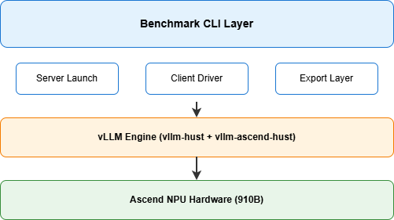
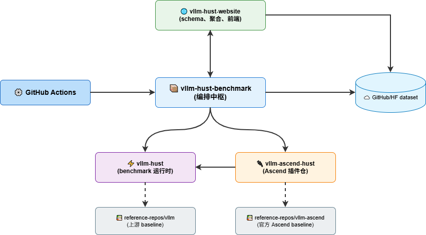
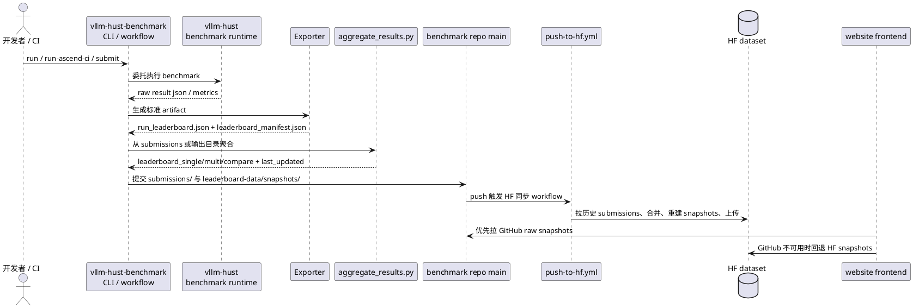
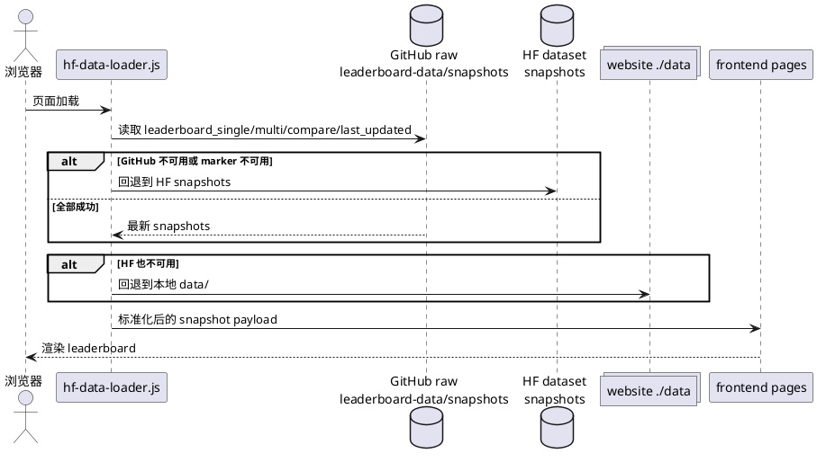
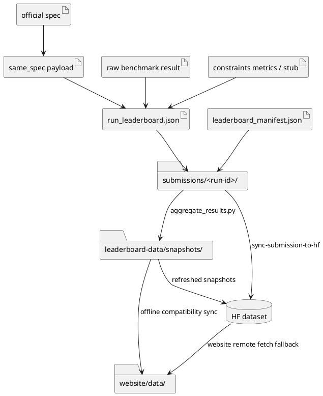
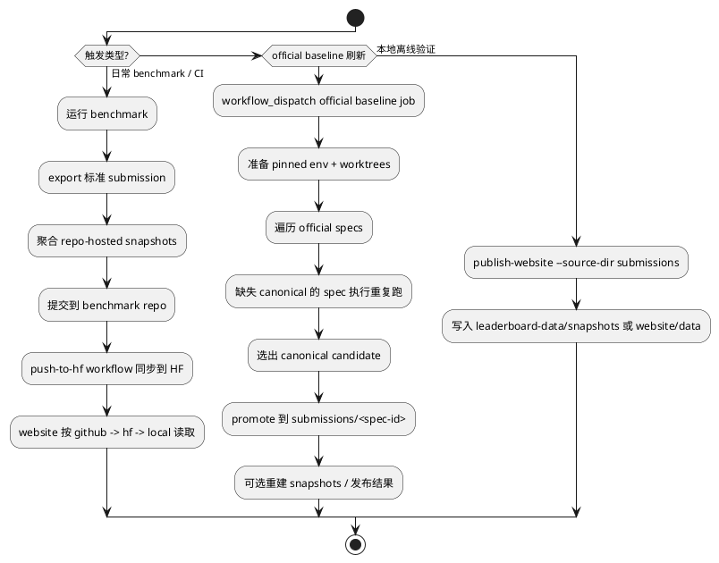

# 国产芯片大模型推理关键指标与基线评测方案


## 1. 概述

本方案定义国产芯片（以华为昇腾 Ascend 910B3 为首批验证对象）上大模型推理引擎的**关键性能指标体系**、**标准化评测场景**与**完整可复现的基线测试流程**。

目标：

1. 建立可量化、可复现、可对比的推理性能评测标准；
2. 覆盖在线服务（Online Serving）、离线吞吐（Offline Throughput）、延迟（Latency）三大类典型业务场景；
3. 形成基线数据集，作为后续优化工作的参考锚点；
4. 提供端到端操作手册，确保任意团队成员可独立复现全部基线数据。

---

## 2. 关键指标体系

### 2.1 核心性能指标（Core Metrics）

| 指标名称 | 缩写 | 单位 | 含义 |
|---------|------|------|------|
| 首 Token 延迟 | TTFT | ms | 从请求发出到收到第一个生成 token 的延迟 |
| Token 间延迟 | ITL / TBT | ms | 相邻两个输出 token 之间的时间间隔 |
| 吞吐量 | Throughput (TPS) | tokens/s | 单位时间内系统生成的总 token 数 |
| 请求错误率 | Error Rate | % | 请求失败 / 总请求数 |

### 2.2 统计分位指标

对于 TTFT 和 ITL，需同时采集以下分位：

- **Mean**（均值）
- **Median**（P50）
- **P95**
- **P99**

### 2.3 约束性指标（Constraints Metrics）

面向项目交付验收的扩展指标：

| 指标 | 说明 |
|------|------|
| `single_chip_effective_utilization_pct` | 单卡有效利用率（%） |
| `typical_throughput_ratio_vs_baseline` | 相对基线的吞吐倍率 |
| `typical_ttft_reduction_pct_vs_baseline` | 相对基线的 TTFT 降幅（%） |
| `typical_tpot_reduction_pct_vs_baseline` | 相对基线的 TPOT 降幅（%） |
| `long_context_ttft_p95_ms` | 长上下文 TTFT P95 |
| `long_context_ttft_p99_ms` | 长上下文 TTFT P99 |
| `long_context_tpot_p95_ms` | 长上下文 TPOT P95 |
| `long_context_tpot_p99_ms` | 长上下文 TPOT P99 |
| `long_context_throughput_stable` | 长上下文吞吐是否稳定 |
| `unit_token_cost_reduction_pct` | 单 token 推理成本降幅（%） |
| `multi_tenant_high_utilization` | 多租户高并发利用率是否达标 |

---

## 3. 评测场景定义

### 3.1 场景总览

共定义 **8 个官方标准场景**，覆盖三大类业务：

| # | 场景名称 | 类型 | 代表业务 | 输入长度 | 输出长度 | 请求数 |
|---|---------|------|---------|---------|---------|--------|
| 1 | `random-online` | Serve | 在线对话 | 固定 1024 | 固定 256 | 200 |
| 2 | `sharegpt-online` | Serve | 在线对话 | 数据集分布 | 数据集分布 | 200 |
| 3 | `prefix-repetition-online` | Serve | 长上下文 | 3840+256 | 256 | 200 |
| 4 | `instructcoder-online` | Serve | 代码助手 | 数据集分布 | 数据集分布 | 2048 |
| 5 | `visionarena-online` | Serve | 多模态 | 数据集分布 | 128 | 1000 |
| 6 | `sharegpt-throughput` | Throughput | 离线批处理 | 数据集分布 | 数据集分布 | 200 |
| 7 | `sonnet-throughput` | Throughput | 离线批处理 | ~550 | 150 | 200 |
| 8 | `random-latency` | Latency | 延迟 SLO | 固定 1024 | 128 | batch=8 |

### 3.2 场景详细说明

#### 3.2.1 `random-online`（基准在线场景）

- 最标准的合成在线基准，固定输入/输出长度，用于回归验证和跨引擎同规格对照
- 请求到达模式：Poisson，默认 QPS=1
- 核心考察指标：TTFT、Throughput TPS

#### 3.2.2 `sharegpt-online`（真实对话在线场景）

- 使用 ShareGPT_V3 数据集模拟真实聊天流量
- 输入/输出长度均为数据集中对话样本的自然分布
- 核心考察指标：TTFT 分布、ITL 分布、Throughput

#### 3.2.3 `prefix-repetition-online`（长上下文前缀缓存场景）

- 模拟多请求共享长前缀的业务场景（如 RAG）
- 语义参数：prefix=3840, suffix=256, num_prefixes=10
- 核心考察指标：Prefix Cache 命中后的 TTFT 改善

#### 3.2.4 `instructcoder-online`（代码生成场景）

- HuggingFace InstructCoder 数据集
- 代码上下文通常较长，输出长度可变
- 核心考察指标：TTFT、吞吐

#### 3.2.5 `visionarena-online`（多模态场景）

- 图文混合输入的多模态在线推理
- 数据集：lmarena-ai/VisionArena-Chat
- 核心考察指标：多模态 TTFT、吞吐

#### 3.2.6 `sharegpt-throughput`（离线吞吐场景）

- 离线批处理模式，不限 QPS，引擎自行调度以最大化吞吐
- 核心考察指标：Throughput TPS

#### 3.2.7 `sonnet-throughput`（轻量离线吞吐场景）

- 较短文本的离线吞吐测试
- 输入约 550 tokens，输出约 150 tokens
- 核心考察指标：Throughput TPS

#### 3.2.8 `random-latency`（固定 batch 延迟场景）

- 固定 batch size=8 的延迟测试
- 10 次预热 + 30 次正式迭代
- 核心考察指标：端到端延迟（Mean / P99）

---

## 4. 评测环境

### 4.1 硬件要求

| 项目 | 规格 |
|------|------|
| 芯片厂商 | 华为（Huawei） |
| 芯片型号 | 昇腾 910B3 |
| HBM 容量 | 64 GB / 卡 |
| 服务器 | Atlas 800I A2 |
| 操作系统 | openEuler / Ubuntu 22.04 (aarch64) |
| 系统内存 | ≥ 128GB |
| 磁盘空间 | ≥ 100GB（模型权重 + 数据集） |
| 卡数配置 | 基线测试使用 1 卡（单卡），可扩展到 2/4/8 卡 |

### 4.2 软件基线版本

| 组件 | 版本 |
|------|------|
| 推理引擎 | vLLM v0.11.0 |
| Ascend 插件 | vllm-ascend v0.11.0 |
| Python | 3.11.x |
| PyTorch | 2.5.x |
| CANN | 8.0+ |
| 评测模型 | Qwen/Qwen2.5-14B-Instruct (FP16) |
| 量化方式 | 无（FP16 基线） |

### 4.3 前置条件

- CANN Toolkit（Ascend-cann-toolkit 8.0+）已安装
- NPU Driver 已正确安装（`npu-smi info` 可正常输出）
- conda / miniconda 已安装
- Git, curl, jq 已安装

### 4.4 验证 NPU 环境

```bash
# 检查 NPU 可用性
npu-smi info -l

# 预期输出包含：
# Total Count : 8  (或实际卡数)
# NPU ID      : 0
```

---

## 5. 评测方法论

### 5.1 测试架构

<!-- 这是一个HTML注释
```
┌─────────────────────────────────────────────────────┐
│                  Benchmark CLI Layer                  │
│           (vllm-hust-benchmark / vllm bench)         │
├─────────────────────────────────────────────────────┤
│  ┌──────────┐   ┌──────────┐   ┌──────────┐        │
│  │  Server  │   │  Client  │   │  Export  │         │
│  │  Launch  │   │  Driver  │   │  Layer   │         │
│  └──────────┘   └──────────┘   └──────────┘        │
├─────────────────────────────────────────────────────┤
│                   vLLM Engine                         │
│              (vllm + vllm-ascend)                     │
├─────────────────────────────────────────────────────┤
│               Ascend NPU Hardware                    │
│              (Atlas 800I A2 / 910B3)                 │
└─────────────────────────────────────────────────────┘
```
-->


### 5.2 测试流程

1. **环境准备**：构建固定版本的 conda 环境，安装 pinned 依赖
2. **模型加载**：下载或使用本地缓存的模型权重
3. **服务启动**：启动 vLLM server，等待健康检查通过
4. **负载生成**：按场景配置发送请求（Poisson 到达或全量并发）
5. **指标采集**：逐请求记录 TTFT、ITL、output tokens 等
6. **结果聚合**：计算均值、中位数、P95、P99 等统计量
7. **数据导出**：生成标准化 JSON 结果文件

### 5.3 可复现性保证

- **固定随机种子**：数据采样和到达时间均使用固定 seed
- **版本锁定**：引擎、插件、依赖均锁定到具体 commit
- **Spec 文件驱动**：每次运行由 JSON spec 文件定义全部参数
- **结果 Hash**：每组结果通过 spec hash 标识完整配置

### 5.4 输出标准

所有评测结果遵循统一的 `run_leaderboard.json` Schema：

```json
{
  "entry_id": "<uuid>",
  "engine": "vllm",
  "engine_version": "0.11.0",
  "config_type": "single_gpu",
  "hardware": { "vendor": "Huawei", "chip_model": "910B3", "chip_count": 1 },
  "model": { "name": "Qwen/Qwen2.5-14B-Instruct", "parameters": "14B", "precision": "FP16" },
  "workload": { "name": "<scenario>", "input_length": ..., "output_length": ... },
  "metrics": { "ttft_ms": ..., "tbt_ms": ..., "throughput_tps": ..., "error_rate": ... },
  "constraints": { ... },
  "same_spec": { "spec_id": "...", "resolved_spec_hash": "..." }
}
```

---

## 6. 系统架构：仓库全景图

### 6.1 仓库级架构图



### 6.2 仓库角色说明

| 仓库 / 系统 | 角色 | 读写属性 | 接手建议 |
| --- | --- | --- | --- |
| `vllm-hust-benchmark` | 编排中枢（主战场） | 读写 | benchmark runtime 编排、workflow、submissions |
| `vllm-hust` | benchmark 运行时与上游兼容入口 | 主要只读 | 不建议在 leaderboard 任务里复制实现 |
| `vllm-ascend-hust` | Ascend 插件仓（含 benchmark workflow） | 读写 | 插件扩展仓，不是 runtime 主仓 |
| `vllm-hust-website` | schema、聚合、前端读取 | 读写 | 需要联合维护接口契约 |
| `reference-repos/vllm` | 上游 baseline runtime | 只读 | 仅用于官方对照 |
| `reference-repos/vllm-ascend` | 官方 Ascend baseline runtime | 只读 | 用于 official baseline target |
| GitHub Actions | 自动化控制平面 | 读写 | 需要 secrets 与 runner 能力 |
| Hugging Face dataset | 聚合结果远端分发面 | 读写 | 需要 token、数据布局稳定 |

### 6.3 Source Of Truth 与所有权

| 领域 | Source of truth | 写入方 | 主要消费方 | 说明 |
| --- | --- | --- | --- | --- |
| benchmark 运行时语义 | `vllm-hust` | `vllm-hust` 团队 | `vllm-hust-benchmark` | benchmark repo 不应复制或重写 runtime benchmark 逻辑 |
| Ascend 插件与 benchmark workflow | `vllm-ascend-hust` | `vllm-ascend-hust` 团队 | `vllm-hust` / `vllm-hust-benchmark` | 插件扩展、trusted runner benchmark workflow、snapshot 回写入口 |
| leaderboard 场景定义 | `official_scenarios.json` | `vllm-hust-benchmark` | exporter、CLI、website 聚合 | workload/business scenario/config 映射在此冻结 |
| 标准 submission contract | `leaderboard_manifest.json` + `run_leaderboard.json` + website schema | `vllm-hust-benchmark` exporter | website 聚合、HF 同步 | 跨仓边界，不允许 ad hoc JSON |
| official baseline spec | `docs/official-baselines/*.json` | `vllm-hust-benchmark` | official runner、same-spec、baseline coverage | 当前官方目标固定为 Ascend + `v0.11.0` |
| website 数据源优先级 | `assets/hf-data-loader.js` | `vllm-hust-website` | 前端 | 当前优先级：`github -> hf -> local` |
| baseline 线上分发 | benchmark repo snapshots + HF dataset | benchmark workflows | website 前端 | GitHub 提供第一优先级 freshness，HF 提供 canonical aggregate |

---

## 7. 系统架构：仓库间接口

### 7.1 接口矩阵

| 调用方 | 被调用方 | 接口形式 | 备注 |
| --- | --- | --- | --- |
| `vllm-ascend-hust` | `vllm-hust` | Ascend 插件扩展、workflow | 插件仓通过 workflow 调用 runtime |
| `vllm-ascend-hust` | `vllm-hust-benchmark` | `submit` / `sync-submission-to-hf` | 产出 submission 并触发同步 |
| `vllm-hust-benchmark` | `vllm-hust` | CLI / shell delegation | 通过 `integration.py` 转发 `vllm bench` |
| `vllm-hust-benchmark` | `vllm-hust-website` | `aggregate_results.py` | 标准聚合边界 |
| `vllm-hust-benchmark` | HF dataset | `sync-submission-to-hf` / `publish-hf` | 上传 snapshot 和 canonical submission |
| `vllm-hust` ↔ `vllm-ascend-hust` | 同名 workflow / script | 同路径镜像或分叉实现 | 两边存在但内容不同 |
| `vllm-hust-website` | benchmark repo / HF | 静态 JSON 拉取 | loader 优先级：GitHub -> HF -> local |
| official runner | spec JSON | `docs/official-baselines/*.json` | spec id、baseline target 参数可解析 |
| exporter | same-spec payload | `benchmark-same-spec/v1` | compare 和 official baseline 可比性锚点 |

### 7.2 当前支持的 benchmark 场景与参数

#### 7.2.1 支持面摘要

当前代码里“场景支持面”的单一事实来源是 `src/vllm_hust_benchmark/data/official_scenarios.json`，并由 `registry.py` 加载为 `ScenarioDefinition`。

| benchmark type | 场景数 | 当前支持场景 |
| --- | --- | --- |
| `serve` | 5 | `sharegpt-online`, `random-online`, `prefix-repetition-online`, `instructcoder-online`, `visionarena-online` |
| `throughput` | 2 | `sharegpt-throughput`, `sonnet-throughput` |
| `latency` | 1 | `random-latency` |

#### 7.2.2 参数语义摘要

参数合并与标准化规则来自 `models.py`：

| 项目 | 规则 |
| --- | --- |
| 默认参数来源 | 每个场景的 `defaults` |
| 运行时覆盖方式 | 通用入口通过重复的 `--set key=value` 覆盖或补充场景参数 |
| 模型参数 | `--model` 是 `run` / `build-command` / `run-both` 的必填参数，不属于场景默认值 |
| serve alias 规则 1 | `num_iters_warmup` 会规范化成 `num_warmups` |
| serve alias 规则 2 | 当 `dataset_name=random` 时，`batch_size` 会规范化成 `random_batch_size` |

#### 7.2.3 Wrapper 差异摘要

| Wrapper | 覆盖范围 | 备注 |
| --- | --- | --- |
| `run` / `build-command` / `run-both` | 面向 registry，原则上覆盖全部 8 个已注册场景 | 新增场景时，通常先验证这层是否已足够 |
| `run-ascend-ci` | 当前只显式支持 `random-online`, `sharegpt-online` | registry 扩容不等于这个 wrapper 自动扩容；要单独评估 |

---

## 8. 系统架构：关键业务场景与交互流程

### 8.1 常规 benchmark 提交与发布

这是 leaderboard 的主链路，适用于 CI 提交、日常性能回归、人工实验归档。



### 8.2 Website 消费链路

website 不是 leaderboard 的生产者，只是标准 snapshot 的消费者。



---

## 9. 系统架构：数据流与 Artifact 生命周期

### 9.1 关键 Artifact 清单

| Artifact | 生产方 | 典型路径 | 消费方 | 说明 |
| --- | --- | --- | --- | --- |
| official baseline spec | benchmark repo | `docs/official-baselines/*.json` | official runner、same-spec resolver | 定义 pinned target、场景、server/client 参数 |
| raw benchmark result | runtime benchmark | `.benchmarks/.../*.json` | exporter | 原始运行结果，不是跨仓 contract |
| constraints metrics / stub | benchmark repo 或外部评估 | `docs/official-baselines/*constraints*.json` | exporter | 当前官方 baseline 可先用 stub |
| same-spec payload | `vllm_hust_benchmark.same_spec` | `same_spec.json` 或嵌入 artifact | compare、official baseline 校验 | 锚定可比参数与 spec hash |
| single submission artifact | exporter | `run_leaderboard.json` | website aggregator、HF sync | schema-compatible 单条记录 |
| submission manifest | exporter | `leaderboard_manifest.json` | aggregator、validator、HF sync | 声明 artifact 与 idempotency key |
| raw submission directory | benchmark repo | `submissions/<run-id>/` | push-to-hf、website offline aggregate | benchmark 归档边界 |
| repo-hosted snapshots | benchmark repo | `leaderboard-data/snapshots/*.json` | website GitHub source | 线上第一优先级 freshness 来源 |
| website snapshots | website repo | `data/*.json` | 前端、本地离线预览 | compatibility cache，不应手工改 |
| HF snapshots | HF dataset | root snapshot files | website HF source | 远端 canonical aggregate 分发面 |

### 9.2 数据流图



### 9.3 数据边界结论

1. 对外稳定边界是 `leaderboard_manifest.json` + `run_leaderboard.json`，不是 raw benchmark result。
2. `leaderboard_compare.json` 是聚合派生产品，不是第二种 submission schema。
3. website 不应自行修补单条 entry，数据错误必须回到 exporter 或 submission 源头修正。
4. HF 同步并不是简单 upload 单个文件，而是“拉取历史 raw submissions -> 合并 -> 重建 snapshots -> 验证 -> 一次性提交”。

---

## 10. 系统架构：控制流

### 10.1 高层控制流图



### 10.2 主要自动化入口

| 入口 | 作用 | 典型使用方式 |
| --- | --- | --- |
| `../vllm-ascend-hust/.github/workflows/ascend-benchmark-leaderboard.yml` | Ascend 插件仓的 benchmark workflow 入口 | PR / push / workflow_dispatch |
| `python -m vllm_hust_benchmark.cli show-repos --validate` | 校验 sibling repo 布局 | 接手后第一个命令 |
| `python -m vllm_hust_benchmark.cli publish-website ...` | 从 submissions 重建 snapshots | 日常回归、本地验链 |
| `python -m vllm_hust_benchmark.cli sync-submission-to-hf ...` | 合并 raw submissions、同步 HF | workflow 内主入口 |
| `.github/workflows/push-to-hf.yml` | 监听 `submissions/**` 变化并同步 HF | 线上分发自动化 |
| `.github/workflows/run-official-ascend-baselines.yml` | 批量刷新官方 Ascend baseline | `workflow_dispatch` |
| `scripts/run-official-ascend-goal-baseline-matrix.sh` | 遍历 specs、重复运行、挑 canonical | 本地或 workflow 调用 |
| `scripts/run-official-ascend-goal-baseline.sh` | 单 spec 运行 pinned official baseline | matrix 内部调用 |

### 10.3 运行所需的外部前提

| 前提 | 用途 | 当前体现 |
| --- | --- | --- |
| self-hosted ARM64 runner | 跑官方 Ascend baseline | workflow labels: `self-hosted`, `ARM64`, `docker`, `debug` |
| `VLLM_ASCEND_HUST_BENCHMARK_SSH_KEY` | GitHub SSH checkout | official baseline workflow 强依赖 |
| `DATASET_WRITE_TOKEN` | HF dataset 写入 | `push-to-hf.yml` 使用 |
| 已配置 conda 环境 | benchmark / baseline 执行 | 当前实现依赖 conda prefix |
| Ascend toolkit / ATB 环境 | official baseline 运行时 | prepare / runner 脚本会 source |
| `reference-repos/vllm` 和 `reference-repos/vllm-ascend` | baseline 参考源 | official prepare 脚本依赖 |

### 10.4 CI/CD 分层 Benchmark 方案

#### 10.4.1 目标与分层定义

| 层级 | 目标 | 建议时长 | 触发方式 | 当前状态 |
| --- | --- | --- | --- | --- |
| L1 Smoke Gate | PR 级快速回归门禁 | ≤ 10 分钟 | PR / push 触发 | 部分落地：已有 `ci.yml`，主要是功能测试 |
| L2 Targeted Verification | 高风险改动架构抽样验证 | 30-60 分钟 | 路径触发 + 手工指令 | 规划中：可复用 `run-ascend-ci`、scenario registry |
| L3 Comprehensive Baseline | 全量基线回归、趋势跟踪 | 小时级 | 定时 / workflow_dispatch | 已落地：`run-official-ascend-baselines.yml` + matrix runner |

#### 10.4.2 与当前代码的映射关系

| 设计能力 | 当前实现入口 | 说明 |
| --- | --- | --- |
| Ascend 插件 workflow | `../vllm-ascend-hust/.github/workflows/ascend-benchmark-leaderboard.yml` | 在受信任 Ascend runner 上执行 benchmark 并触发发布分流 |
| PR 基础 CI | `.github/workflows/ci.yml` | 已有稳定测试门禁，建议作为 L1 的“功能前置门” |
| 提交驱动 HF 同步 | `.github/workflows/push-to-hf.yml` | 已形成发布控制面 |
| 官方 baseline 全量执行 | `.github/workflows/run-official-ascend-baselines.yml` | 已可在 self-hosted Ascend runner 执行 L3 主体流程 |
| 本地/CI 导出标准 artifact | `src/vllm_hust_benchmark/cli.py` | 已形成统一导出边界 |
| 聚合与发布 | `publish-website`, `sync-submission-to-hf` | 已形成 submissions -> snapshots 的稳定派生链路 |

结论：当前系统已具备 L3 与发布链路的主要能力，短板在 L1/L2 的“性能门禁化”和“按需触发治理”。

#### 10.4.3 推荐触发策略

1. **L1（默认门禁）**：PR 默认跑 `ci.yml`（功能正确性），增加轻量性能 smoke job，覆盖 1 个代表场景（如 `random-online`），阈值比较采用最近稳定基线。
2. **L2（按需门禁）**：路径自动触发（变更命中 benchmark/推理热点路径）+ 手工触发（workflow_dispatch 输入 `scenario_list`），抽样来源优先复用 `official_scenarios.json`。
3. **L3（基线与发布）**：继续使用现有 `run-official-ascend-baselines.yml`，保持 `submissions/** -> push-to-hf.yml` 自动同步，GitHub snapshots 为 website 第一优先级。

#### 10.4.4 权限与资源治理

1. **权限控制**：高成本 benchmark 触发（L2/L3）应限制在维护者可控入口（workflow_dispatch + 受控变量）上。
2. **运行环境标准化**：继续沿用 pinned runtime 和 prepare 脚本提供的环境修复能力，L1/L2 也应复用统一环境准备逻辑。
3. **稳定性与容错**：保留 repeat + canonical selector 机制用于 L3，L1/L2 可引入单次自动重试但不得掩盖持续性退化。

#### 10.4.5 验收标准（CI/CD 维度）

1. PR 默认至少包含 1 个性能 smoke 验证，且结果可追溯。
2. 高风险改动可自动或手动触发 L2，且结果参与门禁。
3. L3 定时运行持续产出可用基线，并能被 L1/L2 消费。
4. GitHub snapshots 与 HF sync 的发布链路在失败时有明确告警和回滚路径。
5. 触发权限、runner 资源与 secrets 管理有文档化约束并可审计。

---

## 11. 环境搭建

### 11.1 方式一：使用官方基线环境脚本（推荐）

```bash
cd /workspace/vllm-hust-benchmark

# 设置环境前缀路径
export ENV_PREFIX="$(conda info --base)/envs/vllm-ascend-official-v0110"

# 运行环境准备脚本（自动创建 conda 环境、安装 pinned 版本的 vllm + vllm-ascend）
bash scripts/prepare-official-ascend-baseline-env.sh
```

该脚本将：
1. 创建独立 conda 环境 `vllm-ascend-official-v0110`
2. 安装 vLLM v0.11.0 及其依赖
3. 安装 vllm-ascend v0.11.0
4. 锁定 torch / torch-npu / torchvision 版本

### 11.2 方式二：手动搭建环境

```bash
# 1. 创建 conda 环境
conda create -n vllm-ascend-bench python=3.11 -y
conda activate vllm-ascend-bench

# 2. 安装 PyTorch + torch-npu
pip install torch==2.5.1
pip install torch-npu  # 匹配 CANN 版本

# 3. 安装 vLLM
pip install vllm==0.11.0

# 4. 安装 vllm-ascend
pip install vllm-ascend==0.11.0

# 5. 安装 benchmark 依赖
cd /workspace/vllm-hust-benchmark
pip install -e .

# 6. Source CANN 环境变量
source /usr/local/Ascend/ascend-toolkit/set_env.sh
source /usr/local/Ascend/nnal/atb/set_env.sh
```

### 11.3 准备数据集

```bash
# ShareGPT 数据集（用于 sharegpt-online / sharegpt-throughput）
DATASET_DIR="$HOME/.cache/datasets"
mkdir -p "$DATASET_DIR"

wget -O "$DATASET_DIR/ShareGPT_V3_unfiltered_cleaned_split.json" \
  https://hf-mirror.com/datasets/anon8231489123/ShareGPT_Vicuna_unfiltered/resolve/main/ShareGPT_V3_unfiltered_cleaned_split.json
```

### 11.4 准备模型

```bash
# 下载 Qwen2.5-14B-Instruct 到本地缓存
export HF_ENDPOINT=https://hf-mirror.com
huggingface-cli download Qwen/Qwen2.5-14B-Instruct
```

---

## 12. 基线测试执行

### 12.1 方式一：官方基线全自动运行（推荐）

```bash
cd /workspace/vllm-hust-benchmark

# 设置环境前缀
export GOAL_BASELINE_ENV_PREFIX="$(conda info --base)/envs/vllm-ascend-official-v0110"

# 运行 random-online 基线 Spec
bash scripts/run-official-ascend-goal-baseline.sh \
  docs/official-baselines/official-ascend-jan-2026-v0110-random-online-qwen25-14b-910b3.json

# 运行 sharegpt-online 基线 Spec
bash scripts/run-official-ascend-goal-baseline.sh \
  docs/official-baselines/official-ascend-jan-2026-v0110-sharegpt-online-qwen25-14b-910b3.json

# 运行 sharegpt-throughput 基线 Spec
bash scripts/run-official-ascend-goal-baseline.sh \
  docs/official-baselines/official-ascend-jan-2026-v0110-sharegpt-throughput-qwen25-14b-910b3.json

# 运行 random-latency 基线 Spec
bash scripts/run-official-ascend-goal-baseline.sh \
  docs/official-baselines/official-ascend-jan-2026-v0110-random-latency-qwen25-14b-910b3.json

# 运行所有缺失的基线（matrix 模式）
bash scripts/run-official-ascend-goal-baseline-matrix.sh
```

### 12.2 方式二：使用 vllm-ascend 一键性能脚本

```bash
cd /workspace/vllm-ascend-hust

# 安装 benchmark 依赖
pip install -r benchmarks/requirements-bench.txt

# 运行全套性能测试（latency + throughput + serving）
bash benchmarks/scripts/run-performance-benchmarks.sh

# 结果输出到 benchmarks/results/
ls benchmarks/results/
```

### 12.3 方式三：手动分步执行

#### 12.3.1 在线服务场景（Online Serving）

```bash
# Step 1: 启动 vLLM Server
vllm serve Qwen/Qwen2.5-14B-Instruct \
  --tensor-parallel-size 1 \
  --enforce-eager \
  --trust-remote-code \
  --disable-log-stats \
  --disable-log-requests \
  --dtype float16 \
  --host 0.0.0.0 \
  --port 8000 &

# Step 2: 等待服务就绪
while ! curl -s http://127.0.0.1:8000/health > /dev/null; do
  echo "Waiting for server..."
  sleep 5
done
echo "Server ready!"

# Step 3: 运行 random-online benchmark
vllm bench serve \
  --model Qwen/Qwen2.5-14B-Instruct \
  --backend vllm \
  --endpoint /v1/completions \
  --dataset-name random \
  --num-prompts 200 \
  --random-input-len 1024 \
  --random-output-len 256 \
  --request-rate 1 \
  --host 127.0.0.1 \
  --port 8000 \
  --output-json results/random-online-qps1.json

# Step 4: 运行 sharegpt-online benchmark
vllm bench serve \
  --model Qwen/Qwen2.5-14B-Instruct \
  --backend vllm \
  --endpoint /v1/completions \
  --dataset-name sharegpt \
  --dataset-path ~/.cache/datasets/ShareGPT_V3_unfiltered_cleaned_split.json \
  --num-prompts 200 \
  --request-rate 1 \
  --host 127.0.0.1 \
  --port 8000 \
  --output-json results/sharegpt-online-qps1.json

# Step 5: 停止 Server
kill %1
```

#### 12.3.2 离线吞吐场景（Offline Throughput）

```bash
# ShareGPT Throughput
vllm bench throughput \
  --model Qwen/Qwen2.5-14B-Instruct \
  --tensor-parallel-size 1 \
  --enforce-eager \
  --trust-remote-code \
  --dtype float16 \
  --backend vllm \
  --dataset-name sharegpt \
  --dataset-path ~/.cache/datasets/ShareGPT_V3_unfiltered_cleaned_split.json \
  --num-prompts 200 \
  --output-json results/sharegpt-throughput.json

# Sonnet Throughput
vllm bench throughput \
  --model Qwen/Qwen2.5-14B-Instruct \
  --tensor-parallel-size 1 \
  --enforce-eager \
  --trust-remote-code \
  --dtype float16 \
  --backend vllm \
  --dataset-name sonnet \
  --dataset-path benchmarks/sonnet.txt \
  --num-prompts 200 \
  --output-json results/sonnet-throughput.json
```

#### 12.3.3 延迟场景（Latency）

```bash
vllm bench latency \
  --model Qwen/Qwen2.5-14B-Instruct \
  --tensor-parallel-size 1 \
  --enforce-eager \
  --trust-remote-code \
  --dtype float16 \
  --input-len 1024 \
  --output-len 128 \
  --batch-size 8 \
  --num-iters-warmup 10 \
  --num-iters 30 \
  --output-json results/random-latency.json
```

---

## 13. 结果导出与验证

### 13.1 导出 Leaderboard Artifact

```bash
cd /workspace/vllm-hust-benchmark

# 从原始结果导出标准化 leaderboard JSON
python -m vllm_hust_benchmark.cli export-leaderboard-artifact \
  random-online \
  --benchmark-result-file results/random-online-qps1.json \
  --constraints-file docs/official-baselines/official-ascend-constraints.stub.json \
  --output-dir .benchmarks/exports/my-baseline-run \
  --run-id "baseline-$(date -u +%Y%m%dT%H%M%SZ)" \
  --engine vllm \
  --engine-version 0.11.0 \
  --model-name Qwen/Qwen2.5-14B-Instruct \
  --hardware-chip-model 910B3 \
  --submitter manual-baseline
```

### 13.2 验证结果完整性

```bash
# 检查导出文件
ls .benchmarks/exports/my-baseline-run/
# 预期文件：run_leaderboard.json, leaderboard_manifest.json

# 验证 JSON 格式
python -c "
import json
with open('.benchmarks/exports/my-baseline-run/run_leaderboard.json') as f:
    data = json.load(f)
    print(f'TTFT: {data[\"metrics\"][\"ttft_ms\"]:.1f} ms')
    print(f'Throughput: {data[\"metrics\"][\"throughput_tps\"]:.1f} tps')
    print(f'Error Rate: {data[\"metrics\"][\"error_rate\"]}')
"
```

<!--
---

## 14. 基线数据（华为昇腾 910B3）

以下为在 Huawei 910B3 单卡上，使用 vLLM v0.11.0 + vllm-ascend v0.11.0 运行 Qwen2.5-14B-Instruct (FP16) 获得的官方基线数据。

### 14.1 测试环境

| 项目 | 值 |
|------|-----|
| 硬件 | Huawei Atlas 800I A2, 910B3 × 1 |
| 操作系统 | Linux 5.15.0-25-generic aarch64 |
| Python | 3.11.15 |
| 推理引擎 | vLLM v0.11.0 |
| Ascend 插件 | vllm-ascend v0.11.0 (commit: 2f1aed9) |
| 评测模型 | Qwen/Qwen2.5-14B-Instruct |
| 精度 | FP16 |
| Tensor Parallelism | 1 |

### 14.2 在线服务场景基线

| 场景 | 请求数 | QPS | TTFT (ms) | TBT (ms) | Throughput (tps) | Error Rate |
|------|--------|-----|-----------|-----------|-----------------|------------|
| `random-online` | 200 | 1 | 271.10 | 72.78 | 227.14 | 0% |
| `sharegpt-online` | 200 | 1 | 152.62 | 71.78 | 185.03 | 0% |
| `prefix-repetition-online` | 200 | 1 | 227.98 | 74.26 | 234.25 | 0% |

### 14.3 离线吞吐场景基线

| 场景 | 请求数 | 数据集 | Throughput (tps) | Error Rate |
|------|--------|--------|-----------------|------------|
| `sharegpt-throughput` | 200 | ShareGPT | 1383.05 | 0% |
| `sonnet-throughput` | 200 | Sonnet | 4283.21 | 0% |

### 14.4 延迟场景基线

| 场景 | Batch Size | Input Len | Output Len | 端到端延迟 (ms) | Error Rate |
|------|------------|-----------|------------|----------------|------------|
| `random-latency` | 8 | 1024 | 128 | 9671.39 | 0% |

### 14.5 数据采集时间

- random-online: 2026-05-08
- sharegpt-online: 2026-05-29
- prefix-repetition-online: 2026-05-29
- sharegpt-throughput: 2026-05-31
- sonnet-throughput: 2026-05-31
- random-latency: 2026-05-31

> **说明**：
> - 以上数据为 `official-ascend-baseline` 在 2026 年 5 月采集
> - random-latency 的延迟值为 batch=8 情况下的端到端 TTFT（含全部 token 生成）
> - Throughput 场景的 TTFT 为 0 属于离线模式特性，无首 token 延迟语义

---

## 15. 优化目标与验收标准

基于上述基线数据，后续优化工作的量化目标参考：

| 维度 | 基线锚点 | 优化目标方向 |
|------|---------|-------------|
| TTFT | random-online 271ms | 降低 20%+ |
| 吞吐 | sharegpt-throughput 1383 tps | 提升 100%+（2× 基线） |
| TPOT | TBT ~73ms | 降低 25%+ |
| 长上下文稳定性 | prefix-repetition TTFT 228ms | P95/P99 波动 < 20% |
| 单卡利用率 | 待补充 | > 90% |

---

## 16. 扩展测试

### 16.1 多 QPS 压力测试

对于在线服务场景，可扩展不同 QPS 级别的压力测试：

```bash
# 在 Server 已启动的前提下
for QPS in 1 4 16 inf; do
  RATE_FLAG="--request-rate $QPS"
  if [[ "$QPS" == "inf" ]]; then
    RATE_FLAG="--request-rate inf"
  fi

  vllm bench serve \
    --model Qwen/Qwen2.5-14B-Instruct \
    --backend vllm --endpoint /v1/completions \
    --dataset-name random --num-prompts 200 \
    --random-input-len 1024 --random-output-len 256 \
    $RATE_FLAG --host 127.0.0.1 --port 8000 \
    --output-json "results/random-online-qps${QPS}.json"
done
```

---

## 17. 常见问题

### Q1: NPU 设备被占用

```bash
# 释放 NPU 上残留进程
ps -aux | grep -i vllm | awk '{print $2}' | xargs -r kill -9
lsof -t -i:8000 | xargs -r kill -9
sleep 5
```

### Q2: 模型下载慢

```bash
# 使用 hf-mirror 加速
export HF_ENDPOINT=https://hf-mirror.com
# 或使用 load-format=dummy 跳过权重下载（仅用于验证流程）
vllm serve Qwen/Qwen2.5-14B-Instruct --load-format dummy
```

### Q3: Server 启动超时

- 确认 CANN 环境变量已 source
- 检查 `npu-smi info` 是否正常
- 增大 `READY_TIMEOUT_SECONDS` 到 900s

### Q4: 如何与 CUDA GPU 基线对比

使用 `vllm-hust-benchmark` 的 `run-both` 命令可以对比不同 runtime：

```bash
python -m vllm_hust_benchmark.cli run-both random-online \
  --model Qwen/Qwen2.5-14B-Instruct --execute
```
---

## 18. 附录

### 18.1 评测工具链

| 工具 | 仓库 | 用途 |
|------|------|------|
| `vllm bench` | vllm-hust | 底层 benchmark CLI（serve / throughput / latency） |
| `vllm-hust-benchmark` | vllm-hust-benchmark | 上层编排、场景注册、结果导出 |
| `TraceLoom` | vllm-hust-perf-analyzer | Ascend profiler 离线分析 |
| `run-performance-benchmarks.sh` | vllm-ascend-hust | Ascend 一键性能测试脚本 |

### 18.2 相关文件索引

| 文件路径 | 说明 |
|---------|------|
| `vllm-hust-benchmark/src/vllm_hust_benchmark/data/official_scenarios.json` | 8 个官方场景注册表 |
| `vllm-hust-benchmark/docs/official-baselines/*.json` | 官方基线 Spec 文件 |
| `vllm-hust-benchmark/scripts/run-official-ascend-goal-baseline.sh` | 官方基线运行脚本 |
| `vllm-hust-benchmark/scripts/prepare-official-ascend-baseline-env.sh` | 环境准备脚本 |
| `vllm-ascend-hust/benchmarks/scripts/run-performance-benchmarks.sh` | Ascend 性能测试入口 |
| `vllm-hust-benchmark/submissions/official-ascend-*` | 已采集的基线数据 |

### 18.3 一键复现脚本

将以下内容保存为 `run_baseline_all.sh`，可在 Ascend 机器上一键执行全部基线测试：

```bash
#!/bin/bash
set -euo pipefail

#==============================================================================
# 国产芯片（昇腾 910B3）大模型推理基线测试一键脚本
# 模型：Qwen/Qwen2.5-14B-Instruct (FP16)
# 硬件：单卡 910B3
#==============================================================================

SCRIPT_DIR=$(cd "$(dirname "${BASH_SOURCE[0]}")" && pwd)
MODEL=${MODEL:-"Qwen/Qwen2.5-14B-Instruct"}
DTYPE=${DTYPE:-"float16"}
TP=${TP:-1}
PORT=${PORT:-8000}
RESULT_DIR=${RESULT_DIR:-"$SCRIPT_DIR/baseline-results/$(date -u +%Y%m%dT%H%M%SZ)"}
DATASET_DIR=${DATASET_DIR:-"$HOME/.cache/datasets"}
SHAREGPT_PATH="$DATASET_DIR/ShareGPT_V3_unfiltered_cleaned_split.json"

mkdir -p "$RESULT_DIR"
echo "Results will be saved to: $RESULT_DIR"

# --- Helper Functions ---
wait_for_server() {
  local timeout=600
  local waited=0
  while (( waited < timeout )); do
    if curl -s http://127.0.0.1:$PORT/health > /dev/null 2>&1; then
      echo "Server ready after ${waited}s"
      return 0
    fi
    sleep 5
    (( waited += 5 ))
  done
  echo "ERROR: Server startup timeout" >&2
  return 1
}

kill_server() {
  if [[ -n "${SERVER_PID:-}" ]]; then
    kill "$SERVER_PID" 2>/dev/null || true
    wait "$SERVER_PID" 2>/dev/null || true
  fi
  lsof -t -i:$PORT 2>/dev/null | xargs -r kill -9 2>/dev/null || true
  sleep 3
}

# --- Ensure dataset ---
if [[ ! -f "$SHAREGPT_PATH" ]]; then
  echo "Downloading ShareGPT dataset..."
  mkdir -p "$DATASET_DIR"
  wget -q -O "$SHAREGPT_PATH" \
    https://hf-mirror.com/datasets/anon8231489123/ShareGPT_Vicuna_unfiltered/resolve/main/ShareGPT_V3_unfiltered_cleaned_split.json
fi

# === Phase 1: Online Serving Benchmarks ===
echo "=========================================="
echo "Phase 1: Starting vLLM server..."
echo "=========================================="

vllm serve "$MODEL" \
  --tensor-parallel-size $TP \
  --enforce-eager \
  --trust-remote-code \
  --disable-log-stats \
  --disable-log-requests \
  --dtype $DTYPE \
  --host 0.0.0.0 \
  --port $PORT &
SERVER_PID=$!

wait_for_server

echo "[1/6] Running random-online benchmark..."
vllm bench serve \
  --model "$MODEL" --backend vllm --endpoint /v1/completions \
  --dataset-name random --num-prompts 200 \
  --random-input-len 1024 --random-output-len 256 \
  --request-rate 1 --host 127.0.0.1 --port $PORT \
  --output-json "$RESULT_DIR/random-online-qps1.json"

echo "[2/6] Running sharegpt-online benchmark..."
vllm bench serve \
  --model "$MODEL" --backend vllm --endpoint /v1/completions \
  --dataset-name sharegpt --dataset-path "$SHAREGPT_PATH" \
  --num-prompts 200 --request-rate 1 \
  --host 127.0.0.1 --port $PORT \
  --output-json "$RESULT_DIR/sharegpt-online-qps1.json"

echo "[3/6] Running prefix-repetition-online benchmark..."
vllm bench serve \
  --model "$MODEL" --backend vllm --endpoint /v1/completions \
  --dataset-name prefix_repetition --num-prompts 200 \
  --prefix-repetition-prefix-len 3840 \
  --prefix-repetition-suffix-len 256 \
  --prefix-repetition-num-prefixes 10 \
  --prefix-repetition-output-len 256 \
  --request-rate 1 --host 127.0.0.1 --port $PORT \
  --output-json "$RESULT_DIR/prefix-repetition-online-qps1.json"

kill_server

# === Phase 2: Offline Throughput Benchmarks ===
echo "=========================================="
echo "Phase 2: Offline Throughput Benchmarks"
echo "=========================================="

echo "[4/6] Running sharegpt-throughput benchmark..."
vllm bench throughput \
  --model "$MODEL" --tensor-parallel-size $TP \
  --enforce-eager --trust-remote-code --dtype $DTYPE \
  --backend vllm --dataset-name sharegpt \
  --dataset-path "$SHAREGPT_PATH" --num-prompts 200 \
  --output-json "$RESULT_DIR/sharegpt-throughput.json"

echo "[5/6] Running sonnet-throughput benchmark..."
vllm bench throughput \
  --model "$MODEL" --tensor-parallel-size $TP \
  --enforce-eager --trust-remote-code --dtype $DTYPE \
  --backend vllm --dataset-name sonnet \
  --dataset-path benchmarks/sonnet.txt --num-prompts 200 \
  --output-json "$RESULT_DIR/sonnet-throughput.json"

# === Phase 3: Latency Benchmark ===
echo "=========================================="
echo "Phase 3: Latency Benchmark"
echo "=========================================="

echo "[6/6] Running random-latency benchmark..."
vllm bench latency \
  --model "$MODEL" --tensor-parallel-size $TP \
  --enforce-eager --trust-remote-code --dtype $DTYPE \
  --input-len 1024 --output-len 128 --batch-size 8 \
  --num-iters-warmup 10 --num-iters 30 \
  --output-json "$RESULT_DIR/random-latency.json"

# === Summary ===
echo "=========================================="
echo "All benchmarks completed!"
echo "Results saved to: $RESULT_DIR"
echo "=========================================="
ls -la "$RESULT_DIR"
```

### 18.4 数据来源声明

本方案中所有基线数据来自 `vllm-hust-benchmark` 仓库 `submissions/` 目录下的 `official-ascend-jan-2026-v0.11.0-*` 系列提交，由自动化 CI 在 Atlas 800I A2 服务器上实测产出。

---

---

## 19. 附录：Benchmark 优化方案（完整方法论）

本附录完整并入 `docs/benchmark优化方案` 的原始方案文本，用于保留分层 Benchmark 设计的完整背景、动机和实施路线。第 10.4 节给出与当前仓库现状对齐后的执行版；本附录保留完整方法论，便于后续评审或升级时追溯。

### 19.1 引言

本项目从 vLLM 稳定分支 fork 而来，目标是在国产算力（如昇腾 NPU）上进行推理引擎性能优化。为确保每一次代码变更都带来正向的性能收益，需要建立一套自动化 Benchmark 体系，并将其作为 PR 合并的强制性门禁。然而，直接对所有目标模型和参数进行全量遍历将导致运行时间过长，严重影响开发效率。本方案综合 vLLM 社区与 vllm-ascend 项目的实际做法，提出一套兼顾质量与效率的三层分层 Benchmark 方案，并覆盖标签触发、环境标准化、数据稳定性保障、权限控制及长期维护等配套实践。

### 19.2 业界优秀实践参考

#### 19.2.1 vLLM 社区的分层体系

vLLM 明确区分两类性能测试：

- **Performance Benchmarks**：在 PR 被手动打上 `perf-benchmarks` 和 `ready` 标签时触发，用于验证新变更在各种工作负载下的性能影响，是 PR 级别的快速门禁。
- **Nightly Benchmarks**：通过标签或定时任务触发，在全量大参数模型上与其他推理引擎（TGI、TRT-LLM 等）进行横向对比，并提供公开性能看板。

核心设计：不在 PR 提交时自动运行全量测试，而是通过标签驱动的按需触发，将“快速反馈”与“全面验证”解耦。

#### 19.2.2 vllm-ascend 的多级流水线

vllm-ascend 在 GitHub Actions 上实现了更精细的流水线：

- **Main Tests**：每次 PR 或 Push 自动运行，包含单元测试和端到端测试。
- **Accuracy Testing / Performance Benchmarks**：通过定时任务（每日 2 次）或 PR 标签手动触发，使用 JSON 配置文件定义测试矩阵。
- **环境管理**：Benchmark 脚本自动进行 NPU 状态检查、残留进程清理、健康检查轮询等。

vllm-ascend 明确将性能测试排除在常规 CI 路径之外，避免拖慢日常开发节奏。

### 19.3 核心方案：三层 Benchmark 体系

#### 19.3.1 总体架构

```text
┌──────────────────────────┐
│       PR 提交             │
└────────────┬─────────────┘
         │ 路径过滤 & 标签自动/手动触发
         ▼
┌──────────────────────────┐
│  L1: Smoke Benchmark     │  ≤10 分钟
│  1个小模型 + 核心参数    │  PASS/FAIL
└────────────┬─────────────┘
         │ 通过
         ▼
┌──────────────────────────┐
│  L2: 专项验证（按需）     │  30-60 分钟
│  架构抽样 + 极限参数      │  与 L1 共同构成门禁
└────────────┬─────────────┘
         │ 通过
         ▼
┌──────────────────────────┐
│  人工 Review + Merge     │
└────────────┬─────────────┘
         │ 合并到 main 后不触发 L3
         ▼
┌──────────────────────────┐
│  L3: Comprehensive       │  数小时
│  全量模型 × 参数矩阵      │  看板 + 回归告警
│  (定时/手动触发)          │  更新基线
└──────────────────────────┘
```

#### 19.3.2 L1：PR 门禁快速验证（Smoke Benchmark）

- **定位**：每次 PR 的默认必过门禁，提供最基础、最快速的性能回归反馈。
- **触发方式**：由 PR 自动触发（路径过滤：仅文档、注释等非代码变更可跳过）。支持通过 `perf-benchmarks` 标签手动重跑。
- **模型选择**：仅选取一个最具代表性的小模型（如 Qwen2.5-7B），可使用 dummy 权重加快速度。
- **参数精简**：延迟测试固定输入长度 1024、输出长度 128；吞吐测试 `num_prompts: 100`；服务测试仅测试 `qps=4` 一个压力点。
- **对比基线**：与最近一次 L3 产出的基线对比，退化超过阈值（如 5%）则阻止合并。

#### 19.3.3 L2：专项验证层（Targeted Verification）

- **定位**：填补 L1 与 L3 之间的空白，当代码改动触及关键路径时提供更深入的验证。
- **触发方式**：代码路径自动触发（修改 `csrc/`、`vllm_ascend/` 等核心目录）+ 手动精准触发（PR 评论命令如 `/perf-test qwen3-30b-a3b`）。
- **模型选择**：架构抽样（Dense、MoE、Vision-Language 各选一个）+ 规模抽样（覆盖 7B、13B、30B 等），总时长控制在 30-60 分钟。
- **结果与门禁**：与最新基线比较，退化超过阈值则阻止合入，结果自动评论在 PR 中。

#### 19.3.4 L3：全面回归与基线管理（Comprehensive Benchmark）

- **定位**：终极性能验证层，负责长期趋势监控、全量基线更新和外部对比。
- **触发方式**：定时运行（每日或每 12 小时）+ 手动触发（`nightly-test` 标签和 `/nightly` 评论命令）。
- **覆盖范围**：包含目标支持的全部模型（Dense、MoE、多模态），按参数量分级并分配 NPU 数量。
- **基线更新**：每次 L3 成功后输出 `baseline.json`，上传统一存储，供 L1/L2 门禁拉取。

#### 19.3.5 关于“PR 触发”与“合并触发”的取舍

本方案采纳简化策略：仅保留 PR 门禁，不进行合并后触发，基线更新由定时 L3 负责。

#### 19.3.6 标签触发与评论命令机制

采用“评论指令 + 标签”组合：开发者评论请求测试 → 有权限成员审核后打标签 → workflow 被标签触发 → 形成天然权限审批。应先发评论，再打标签。

#### 19.3.7 定期评估与校准机制

每月一次或有重大模型引入时，评估 L1 代表模型覆盖度、L2 抽样覆盖度与时长、L3 矩阵是否需要增减模型。输出通过 PR 评审流程落地。

### 19.4 性能数据稳定性保障

国产算力环境下，硬件频率波动、温度影响、算子编译缓存等因素会导致性能噪声。建议措施：

1. **环境锁定与隔离**：使用固定 Docker 镜像，锁定 CANN、驱动、Python 依赖版本；通过 `taskset` 或 cgroup 绑定 CPU 核心，关闭动态调频；确保 NPU 独占，执行前后清理残留进程。
2. **测试方法标准化**：充分预热（如预热 5 次，测量 15 次以上）；以 P50 为核心对比指标，辅以 P99 观察尾延迟；使用固定种子 dummy 输入或均匀请求模式。
3. **自动容错**：阈值建议 5%，并支持自动重试一次；若重试仍退化则阻断，重试通过则标记为波动忽略。

### 19.5 标签权限控制

GitHub 标签默认无法细粒度授权，建议组合策略：

- **工作流内鉴权**：首步检查 `github.actor` 是否在授权名单。
- **评论命令双保险**：同时验证标签触发者与命令发出者身份。
- **仓库 Rulesets（推荐）**：限制高权限标签的增删权限。
- **Environment 保护（可选增强）**：对高成本 Job 配置审批人或等待时间。

建议采用“规则集 + 工作流鉴权”，高风险测试叠加 Environment 审批。

### 19.6 环境标准化：Docker 镜像实践

1. **基础镜像选择**：优先使用官方 CANN/NPU 镜像，使用具体版本或 digest，避免 `latest`。
2. **定制化构建**：Dockerfile 先复制依赖清单再安装，利用缓存；在依赖文件中固定 Python 包版本；模型权重与驱动不打包进镜像，运行时挂载。
3. **CI 集成**：使用 CI 专用镜像（如 `Dockerfile.ci`），并可带 commit 标识确保可追溯。
4. **多平台支持**：按硬件/系统使用构建矩阵生成镜像。

### 19.7 实施路线图

| 阶段 | 时间 | 关键任务 | 触发与说明 |
| --- | --- | --- | --- |
| 第一阶段 | 1-2 周 | 搭建 L1 门禁 | PR 自动触发，实现基线对比，配置路径过滤和权限控制 |
| 第二阶段 | 2-4 周 | 构建 L3 全面回归 | 定时触发（主分支），实现全量矩阵、基线产出、看板和告警 |
| 第三阶段 | 2-3 周 | 建设看板与自动化告警 | 依赖 L3 数据，完成 Dashboard、自动通知与 Issue 创建 |
| 第四阶段 | 3-4 周 | 建设 L2 专项验证 | 依赖 L3 矩阵与基线，实现代码路径自动触发 + 评论手动触发 |
| 第五阶段 | 持续 | 定期评估与校准 | 每月或按需评审并更新测试矩阵，纳入标准变更流程 |

### 19.8 结语

该方案通过“轻量门禁（L1）+ 按需专项（L2）+ 全面回归（L3）”形成分层 Benchmark 体系，并配套环境控制、统计容错和权限治理。在国产算力复杂环境中，这种分层方式可以同时兼顾 PR 级快速反馈与长期基线守护，为推理引擎持续性能优化提供稳定机制。

-->
